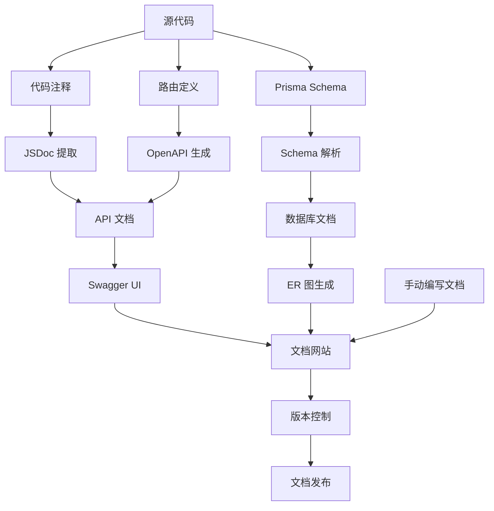
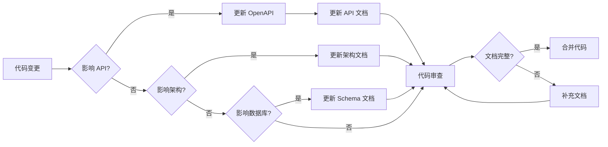

# 设计文档：文档组织和归档

## 概述

本设计文档描述了"文档组织和归档"功能的技术实现方案。该功能旨在建立完整、规范的项目文档体系，提升项目的可维护性和新开发者的上手体验。

### 目标

1. 建立标准化的文档目录结构，便于团队成员快速查找所需文档
2. 创建完整的 API 文档，包括 REST API 和 WebSocket 协议
3. 提供系统架构文档，帮助开发者理解系统设计
4. 补充数据库设计文档，说明数据模型和表关系
5. 创建部署和运维文档，指导生产环境部署
6. 编写开发指南和贡献规范，规范开发流程
7. 提供故障排查文档，加速问题解决
8. 改善代码注释质量，提高代码可读性
9. 建立文档维护机制，确保文档与代码同步

### 范围

本功能涵盖以下内容：

- 文档目录结构设计和实施
- API 文档生成（OpenAPI 规范 + Swagger UI）
- 架构文档编写（包含 Mermaid 图表）
- 数据库设计文档（基于 Prisma schema）
- WebSocket 协议文档
- 部署和运维指南
- 开发者指南和编码规范
- 故障排查手册
- 代码注释改进
- 文档维护流程和模板

### 技术栈

- **文档格式**: Markdown
- **API 文档**: OpenAPI 3.0 + Swagger UI
- **图表工具**: Mermaid
- **数据库文档**: Prisma schema + 自定义脚本
- **版本控制**: Git

## 架构

### 文档组织架构

文档系统采用分层、模块化的组织结构，按照文档类型和目标受众进行分类：

```
docs/
├── README.md                    # 文档索引和导航
├── api/                         # API 文档
│   ├── rest-api.md             # REST API 概览
│   ├── openapi.yaml            # OpenAPI 规范
│   ├── websocket.md            # WebSocket 协议
│   └── authentication.md       # 认证和授权
├── architecture/               # 架构文档
│   ├── overview.md             # 系统架构概览
│   ├── frontend.md             # 前端架构
│   ├── backend.md              # 后端架构
│   ├── data-flow.md            # 数据流设计
│   └── caching.md              # 缓存策略
├── database/                   # 数据库文档
│   ├── schema.md               # 数据库设计
│   ├── er-diagram.md           # ER 图
│   ├── migrations.md           # 迁移策略
│   └── queries.md              # 常用查询
├── deployment/                 # 部署文档
│   ├── requirements.md         # 环境要求
│   ├── installation.md         # 安装步骤
│   ├── docker.md               # Docker 部署
│   ├── configuration.md        # 配置说明
│   └── monitoring.md           # 监控和日志
├── development/                # 开发文档
│   ├── setup.md                # 开发环境搭建
│   ├── structure.md            # 项目结构
│   ├── coding-standards.md     # 编码规范
│   ├── git-workflow.md         # Git 工作流
│   └── testing.md              # 测试指南
├── troubleshooting/            # 故障排查
│   ├── common-issues.md        # 常见问题
│   ├── database.md             # 数据库问题
│   ├── websocket.md            # WebSocket 问题
│   └── performance.md          # 性能问题
└── templates/                  # 文档模板
    ├── api-endpoint.md         # API 端点模板
    ├── feature-doc.md          # 功能文档模板
    └── troubleshooting.md      # 故障排查模板
```

### 文档生成流程



### 文档维护流程



## 组件和接口

### 1. 文档生成器组件

#### OpenAPI 生成器

负责从路由定义和 JSDoc 注释生成 OpenAPI 规范。

```typescript
interface OpenAPIGenerator {
  /**
   * 扫描路由文件并生成 OpenAPI 规范
   * @param routesDir 路由文件目录
   * @returns OpenAPI 规范对象
   */
  generateSpec(routesDir: string): OpenAPISpec;
  
  /**
   * 将 OpenAPI 规范写入文件
   * @param spec OpenAPI 规范对象
   * @param outputPath 输出文件路径
   */
  writeSpec(spec: OpenAPISpec, outputPath: string): void;
  
  /**
   * 验证 OpenAPI 规范的有效性
   * @param spec OpenAPI 规范对象
   * @returns 验证结果
   */
  validateSpec(spec: OpenAPISpec): ValidationResult;
}
```

#### 数据库文档生成器

负责从 Prisma schema 生成数据库设计文档和 ER 图。

```typescript
interface DatabaseDocGenerator {
  /**
   * 解析 Prisma schema 文件
   * @param schemaPath schema 文件路径
   * @returns 解析后的 schema 对象
   */
  parseSchema(schemaPath: string): ParsedSchema;
  
  /**
   * 生成数据库设计文档
   * @param schema 解析后的 schema
   * @returns Markdown 格式的文档
   */
  generateSchemaDoc(schema: ParsedSchema): string;
  
  /**
   * 生成 Mermaid ER 图
   * @param schema 解析后的 schema
   * @returns Mermaid 图表代码
   */
  generateERDiagram(schema: ParsedSchema): string;
}
```

### 2. 文档结构管理器

负责创建和维护文档目录结构。

```typescript
interface DocumentationStructureManager {
  /**
   * 创建标准文档目录结构
   * @param rootDir 项目根目录
   */
  createStructure(rootDir: string): void;
  
  /**
   * 迁移现有文档到新结构
   * @param oldPaths 旧文档路径列表
   * @param newStructure 新目录结构
   */
  migrateDocuments(oldPaths: string[], newStructure: DocumentStructure): void;
  
  /**
   * 生成文档索引
   * @param docsDir 文档目录
   * @returns 文档索引内容
   */
  generateIndex(docsDir: string): string;
  
  /**
   * 验证文档结构完整性
   * @param docsDir 文档目录
   * @returns 验证结果
   */
  validateStructure(docsDir: string): ValidationResult;
}
```

### 3. 代码注释增强器

负责分析代码并添加或改进注释。

```typescript
interface CodeCommentEnhancer {
  /**
   * 扫描文件并识别缺少注释的函数
   * @param filePath 文件路径
   * @returns 缺少注释的函数列表
   */
  findUndocumentedFunctions(filePath: string): FunctionInfo[];
  
  /**
   * 为函数生成 JSDoc 注释模板
   * @param functionInfo 函数信息
   * @returns JSDoc 注释模板
   */
  generateJSDocTemplate(functionInfo: FunctionInfo): string;
  
  /**
   * 验证 JSDoc 注释的完整性
   * @param comment JSDoc 注释
   * @param functionInfo 函数信息
   * @returns 验证结果
   */
  validateJSDoc(comment: string, functionInfo: FunctionInfo): ValidationResult;
}
```

### 4. 文档模板管理器

负责管理和应用文档模板。

```typescript
interface DocumentTemplateManager {
  /**
   * 加载文档模板
   * @param templateName 模板名称
   * @returns 模板内容
   */
  loadTemplate(templateName: string): string;
  
  /**
   * 使用模板创建新文档
   * @param templateName 模板名称
   * @param data 填充数据
   * @returns 生成的文档内容
   */
  createFromTemplate(templateName: string, data: Record<string, any>): string;
  
  /**
   * 验证文档是否符合模板要求
   * @param document 文档内容
   * @param templateName 模板名称
   * @returns 验证结果
   */
  validateAgainstTemplate(document: string, templateName: string): ValidationResult;
}
```

## 数据模型

### OpenAPI 规范结构

```typescript
interface OpenAPISpec {
  openapi: '3.0.0';
  info: {
    title: string;
    version: string;
    description: string;
    contact?: {
      name: string;
      email: string;
    };
  };
  servers: Array<{
    url: string;
    description: string;
  }>;
  paths: Record<string, PathItem>;
  components: {
    schemas: Record<string, Schema>;
    securitySchemes: Record<string, SecurityScheme>;
  };
  tags: Array<{
    name: string;
    description: string;
  }>;
}

interface PathItem {
  get?: Operation;
  post?: Operation;
  put?: Operation;
  delete?: Operation;
  patch?: Operation;
}

interface Operation {
  summary: string;
  description?: string;
  tags: string[];
  parameters?: Parameter[];
  requestBody?: RequestBody;
  responses: Record<string, Response>;
  security?: SecurityRequirement[];
}

interface Parameter {
  name: string;
  in: 'query' | 'path' | 'header' | 'cookie';
  description?: string;
  required: boolean;
  schema: Schema;
}

interface RequestBody {
  description?: string;
  required: boolean;
  content: Record<string, MediaType>;
}

interface Response {
  description: string;
  content?: Record<string, MediaType>;
}

interface MediaType {
  schema: Schema;
  examples?: Record<string, Example>;
}

interface Schema {
  type: string;
  properties?: Record<string, Schema>;
  required?: string[];
  items?: Schema;
  enum?: any[];
  format?: string;
  description?: string;
}

interface SecurityScheme {
  type: 'http' | 'apiKey' | 'oauth2' | 'openIdConnect';
  scheme?: string;
  bearerFormat?: string;
  in?: 'query' | 'header' | 'cookie';
  name?: string;
}

interface Example {
  summary?: string;
  description?: string;
  value: any;
}

interface SecurityRequirement {
  [name: string]: string[];
}
```

### 文档结构模型

```typescript
interface DocumentStructure {
  root: string;
  directories: Directory[];
}

interface Directory {
  name: string;
  path: string;
  description: string;
  files: DocumentFile[];
  subdirectories?: Directory[];
}

interface DocumentFile {
  name: string;
  path: string;
  title: string;
  description: string;
  lastUpdated?: Date;
  version?: string;
  author?: string;
  tags?: string[];
}
```

### Prisma Schema 解析模型

```typescript
interface ParsedSchema {
  models: Model[];
  enums: Enum[];
  datasource: Datasource;
  generator: Generator;
}

interface Model {
  name: string;
  fields: Field[];
  indexes: Index[];
  uniqueConstraints: UniqueConstraint[];
  documentation?: string;
}

interface Field {
  name: string;
  type: string;
  isRequired: boolean;
  isUnique: boolean;
  isList: boolean;
  isId: boolean;
  defaultValue?: any;
  relationName?: string;
  relationFields?: string[];
  relationReferences?: string[];
  documentation?: string;
}

interface Index {
  fields: string[];
  name?: string;
}

interface UniqueConstraint {
  fields: string[];
  name?: string;
}

interface Enum {
  name: string;
  values: string[];
  documentation?: string;
}

interface Datasource {
  provider: string;
  url: string;
}

interface Generator {
  provider: string;
  output?: string;
}
```

### 函数信息模型

```typescript
interface FunctionInfo {
  name: string;
  filePath: string;
  lineNumber: number;
  parameters: ParameterInfo[];
  returnType?: string;
  isAsync: boolean;
  isExported: boolean;
  complexity?: number;
  existingComment?: string;
}

interface ParameterInfo {
  name: string;
  type?: string;
  isOptional: boolean;
  defaultValue?: any;
}
```

### 验证结果模型

```typescript
interface ValidationResult {
  isValid: boolean;
  errors: ValidationError[];
  warnings: ValidationWarning[];
}

interface ValidationError {
  code: string;
  message: string;
  location?: {
    file: string;
    line: number;
    column: number;
  };
}

interface ValidationWarning {
  code: string;
  message: string;
  suggestion?: string;
  location?: {
    file: string;
    line: number;
    column: number;
  };
}
```


## 正确性属性

*属性是一个特征或行为，应该在系统的所有有效执行中保持为真——本质上是关于系统应该做什么的形式化陈述。属性作为人类可读规范和机器可验证正确性保证之间的桥梁。*

### 属性 1: 文档迁移保持位置正确性

*对于任意*文档列表和目标目录结构，迁移操作后，每个文档应该出现在其对应的正确目录中，且文件内容保持不变。

**验证需求: 1.3**

### 属性 2: 文档索引完整性

*对于任意*文档集合，生成的索引文件应该包含所有文档的引用，且每个引用都包含文档路径和描述信息。

**验证需求: 1.4**

### 属性 3: Git 历史保持不变

*对于任意*文档文件，迁移前后的 git 提交历史应该保持一致，即迁移操作使用 `git mv` 而不是删除后重建。

**验证需求: 1.5**

### 属性 4: OpenAPI 规范完整性

*对于任意*API 端点集合，生成的 OpenAPI 规范应该包含所有端点，且每个端点的文档都包含请求方法、路径、参数、请求体、响应格式和状态码等所有必需字段。

**验证需求: 2.1, 2.2**

### 属性 5: API 端点示例生成

*对于任意*API 端点，生成的文档应该包含至少一个请求示例和一个响应示例。

**验证需求: 2.4**

### 属性 6: 数据库文档生成完整性

*对于任意*有效的 Prisma schema，生成的数据库文档应该包含 schema 中定义的所有模型，且每个模型的文档都包含所有字段的名称、类型、约束和关系信息。

**验证需求: 4.1, 4.2**

### 属性 7: WebSocket 事件文档完整性

*对于任意*WebSocket 事件类型集合（包括客户端和服务端事件），生成的协议文档应该列出所有事件类型及其消息格式。

**验证需求: 5.1, 5.2**

### 属性 8: WebSocket 事件示例生成

*对于任意*WebSocket 事件类型，生成的文档应该包含该事件的消息示例，展示完整的消息结构。

**验证需求: 5.5**

### 属性 9: JSDoc 注释生成完整性

*对于任意*缺少注释的函数（包括公共 API 和内部函数），生成的 JSDoc 注释应该包含函数用途描述、所有参数的说明（包括类型）、返回值说明和可能抛出的异常说明。

**验证需求: 9.1, 9.2, 9.4**

### 属性 10: 大文件重构建议

*对于任意*代码文件，如果其行数超过配置的阈值（默认 500 行），系统应该生成重构建议，说明文件过大的问题和可能的拆分方案。

**验证需求: 9.7**

### 属性 11: 文档元数据完整性

*对于任意*生成的文档文件，文档应该包含元数据部分，其中包含最后更新日期和版本信息。

**验证需求: 10.5**

## 错误处理

### 1. 文件系统错误

**错误场景:**
- 目标目录不存在或无写入权限
- 源文件不存在或无读取权限
- 磁盘空间不足

**处理策略:**
- 在操作前验证目录权限和磁盘空间
- 使用事务性操作，失败时回滚已创建的文件
- 记录详细的错误日志，包括文件路径和错误原因
- 向用户提供清晰的错误消息和修复建议

**示例:**
```typescript
try {
  await fs.mkdir(docsDir, { recursive: true });
} catch (error) {
  if (error.code === 'EACCES') {
    throw new DocumentationError(
      `无法创建目录 ${docsDir}：权限不足`,
      'PERMISSION_DENIED',
      { path: docsDir, suggestion: '请检查目录权限或使用 sudo' }
    );
  } else if (error.code === 'ENOSPC') {
    throw new DocumentationError(
      '磁盘空间不足',
      'DISK_FULL',
      { suggestion: '请清理磁盘空间后重试' }
    );
  }
  throw error;
}
```

### 2. 解析错误

**错误场景:**
- Prisma schema 语法错误
- 路由文件格式不符合预期
- JSDoc 注释格式错误

**处理策略:**
- 使用健壮的解析器，提供详细的语法错误信息
- 在解析失败时跳过该文件，继续处理其他文件
- 收集所有解析错误，在最后统一报告
- 提供错误位置（文件名、行号、列号）

**示例:**
```typescript
try {
  const schema = await parseSchema(schemaPath);
} catch (error) {
  if (error instanceof SyntaxError) {
    logger.error(`Prisma schema 解析失败: ${schemaPath}`, {
      line: error.line,
      column: error.column,
      message: error.message
    });
    // 继续处理其他文件
    return null;
  }
  throw error;
}
```

### 3. Git 操作错误

**错误场景:**
- 不在 git 仓库中
- 文件有未提交的更改
- git 命令执行失败

**处理策略:**
- 在执行 git 操作前检查是否在 git 仓库中
- 检查文件状态，警告用户未提交的更改
- 提供降级方案：如果 git mv 失败，使用普通文件复制
- 记录 git 操作日志

**示例:**
```typescript
async function moveWithGitHistory(oldPath: string, newPath: string): Promise<void> {
  const isGitRepo = await checkGitRepository();
  
  if (!isGitRepo) {
    logger.warn('不在 git 仓库中，使用普通文件移动');
    await fs.rename(oldPath, newPath);
    return;
  }
  
  try {
    await execGitCommand(['mv', oldPath, newPath]);
  } catch (error) {
    logger.error('git mv 失败，降级为普通文件移动', { error });
    await fs.rename(oldPath, newPath);
  }
}
```

### 4. 验证错误

**错误场景:**
- OpenAPI 规范不符合标准
- 生成的文档缺少必需字段
- 文档结构不完整

**处理策略:**
- 使用标准验证器（如 OpenAPI validator）
- 在生成后立即验证，发现问题及时修正
- 提供验证报告，列出所有问题和警告
- 允许用户选择是否强制通过验证

**示例:**
```typescript
const validationResult = await validateOpenAPISpec(spec);

if (!validationResult.isValid) {
  logger.warn('OpenAPI 规范验证失败', {
    errors: validationResult.errors,
    warnings: validationResult.warnings
  });
  
  if (options.strict) {
    throw new ValidationError('OpenAPI 规范不符合标准', validationResult.errors);
  }
}
```

### 5. 并发错误

**错误场景:**
- 多个进程同时修改文档
- 文件被其他程序锁定

**处理策略:**
- 使用文件锁机制防止并发写入
- 实现重试逻辑，处理临时锁定
- 提供清晰的错误消息，说明文件被占用

**示例:**
```typescript
async function writeDocumentWithLock(path: string, content: string): Promise<void> {
  const lockPath = `${path}.lock`;
  let retries = 3;
  
  while (retries > 0) {
    try {
      // 尝试创建锁文件
      await fs.writeFile(lockPath, process.pid.toString(), { flag: 'wx' });
      
      try {
        await fs.writeFile(path, content);
      } finally {
        await fs.unlink(lockPath);
      }
      return;
    } catch (error) {
      if (error.code === 'EEXIST') {
        retries--;
        await sleep(1000);
      } else {
        throw error;
      }
    }
  }
  
  throw new DocumentationError('文件被锁定，无法写入', 'FILE_LOCKED', { path });
}
```

## 测试策略

### 双重测试方法

本功能采用单元测试和属性测试相结合的方法，确保全面的测试覆盖：

- **单元测试**: 验证特定示例、边缘情况和错误条件
- **属性测试**: 验证跨所有输入的通用属性

两者是互补的，都是全面覆盖所必需的。单元测试捕获具体的错误，属性测试验证一般正确性。

### 单元测试策略

单元测试应该专注于：

1. **特定示例**: 验证核心功能的正确行为
   - 创建标准文档结构
   - 生成 OpenAPI 规范
   - 解析 Prisma schema
   - 生成 JSDoc 注释

2. **边缘情况**:
   - 空文档列表
   - 不存在的文件路径
   - 无效的 schema 语法
   - 特殊字符在文件名中

3. **错误条件**:
   - 权限不足
   - 磁盘空间不足
   - 无效的输入格式
   - Git 操作失败

4. **集成点**:
   - 文件系统操作
   - Git 命令执行
   - 外部验证器调用

**示例单元测试:**

```typescript
describe('DocumentationStructureManager', () => {
  describe('createStructure', () => {
    it('应该创建所有必需的目录', async () => {
      const manager = new DocumentationStructureManager();
      const rootDir = '/tmp/test-project';
      
      await manager.createStructure(rootDir);
      
      const expectedDirs = [
        'docs',
        'docs/api',
        'docs/architecture',
        'docs/database',
        'docs/deployment',
        'docs/development',
        'docs/troubleshooting',
        'docs/templates'
      ];
      
      for (const dir of expectedDirs) {
        expect(await fs.pathExists(path.join(rootDir, dir))).toBe(true);
      }
    });
    
    it('应该处理已存在的目录', async () => {
      const manager = new DocumentationStructureManager();
      const rootDir = '/tmp/test-project';
      
      await fs.mkdir(path.join(rootDir, 'docs'), { recursive: true });
      
      // 不应该抛出错误
      await expect(manager.createStructure(rootDir)).resolves.not.toThrow();
    });
  });
});
```

### 属性测试策略

属性测试使用 **fast-check** 库，每个测试运行最少 100 次迭代。每个属性测试必须引用其设计文档属性。

**标签格式**: `Feature: documentation-organization-and-archiving, Property {number}: {property_text}`

**属性测试配置:**

```typescript
import * as fc from 'fast-check';

const testConfig = {
  numRuns: 100, // 最少迭代次数
  verbose: true,
  seed: Date.now() // 可重现的随机性
};
```

**属性测试示例:**

```typescript
describe('Property Tests', () => {
  describe('Property 2: 文档索引完整性', () => {
    it('Feature: documentation-organization-and-archiving, Property 2: 对于任意文档集合，生成的索引应该包含所有文档的引用', async () => {
      await fc.assert(
        fc.asyncProperty(
          fc.array(fc.record({
            name: fc.string({ minLength: 1, maxLength: 50 }),
            path: fc.string({ minLength: 1, maxLength: 100 }),
            description: fc.string({ maxLength: 200 })
          })),
          async (documents) => {
            const manager = new DocumentationStructureManager();
            const index = await manager.generateIndex(documents);
            
            // 验证所有文档都在索引中
            for (const doc of documents) {
              expect(index).toContain(doc.name);
              expect(index).toContain(doc.path);
            }
          }
        ),
        testConfig
      );
    });
  });
  
  describe('Property 4: OpenAPI 规范完整性', () => {
    it('Feature: documentation-organization-and-archiving, Property 4: 对于任意 API 端点集合，生成的 OpenAPI 规范应该包含所有端点及其完整信息', async () => {
      await fc.assert(
        fc.asyncProperty(
          fc.array(fc.record({
            method: fc.constantFrom('GET', 'POST', 'PUT', 'DELETE', 'PATCH'),
            path: fc.string({ minLength: 1 }).map(s => `/${s}`),
            summary: fc.string({ minLength: 1, maxLength: 100 }),
            parameters: fc.array(fc.record({
              name: fc.string({ minLength: 1 }),
              in: fc.constantFrom('query', 'path', 'header'),
              required: fc.boolean(),
              type: fc.constantFrom('string', 'number', 'boolean')
            }))
          })),
          async (endpoints) => {
            const generator = new OpenAPIGenerator();
            const spec = await generator.generateSpec(endpoints);
            
            // 验证所有端点都在规范中
            for (const endpoint of endpoints) {
              const pathItem = spec.paths[endpoint.path];
              expect(pathItem).toBeDefined();
              
              const operation = pathItem[endpoint.method.toLowerCase()];
              expect(operation).toBeDefined();
              expect(operation.summary).toBe(endpoint.summary);
              
              // 验证所有参数都被包含
              if (endpoint.parameters.length > 0) {
                expect(operation.parameters).toBeDefined();
                expect(operation.parameters.length).toBe(endpoint.parameters.length);
              }
            }
          }
        ),
        testConfig
      );
    });
  });
  
  describe('Property 6: 数据库文档生成完整性', () => {
    it('Feature: documentation-organization-and-archiving, Property 6: 对于任意 Prisma schema，生成的文档应该包含所有模型和字段', async () => {
      await fc.assert(
        fc.asyncProperty(
          fc.array(fc.record({
            name: fc.string({ minLength: 1, maxLength: 30 }),
            fields: fc.array(fc.record({
              name: fc.string({ minLength: 1, maxLength: 30 }),
              type: fc.constantFrom('String', 'Int', 'Float', 'Boolean', 'DateTime'),
              isRequired: fc.boolean(),
              isUnique: fc.boolean()
            }), { minLength: 1 })
          }), { minLength: 1 }),
          async (models) => {
            const generator = new DatabaseDocGenerator();
            const schema = createMockSchema(models);
            const doc = await generator.generateSchemaDoc(schema);
            
            // 验证所有模型都在文档中
            for (const model of models) {
              expect(doc).toContain(model.name);
              
              // 验证所有字段都在文档中
              for (const field of model.fields) {
                expect(doc).toContain(field.name);
                expect(doc).toContain(field.type);
              }
            }
          }
        ),
        testConfig
      );
    });
  });
  
  describe('Property 9: JSDoc 注释生成完整性', () => {
    it('Feature: documentation-organization-and-archiving, Property 9: 对于任意函数，生成的 JSDoc 应该包含所有必需部分', async () => {
      await fc.assert(
        fc.asyncProperty(
          fc.record({
            name: fc.string({ minLength: 1, maxLength: 50 }),
            parameters: fc.array(fc.record({
              name: fc.string({ minLength: 1, maxLength: 30 }),
              type: fc.constantFrom('string', 'number', 'boolean', 'object', 'any'),
              isOptional: fc.boolean()
            })),
            returnType: fc.option(fc.constantFrom('string', 'number', 'boolean', 'void', 'Promise<any>'), { nil: undefined }),
            isAsync: fc.boolean()
          }),
          async (functionInfo) => {
            const enhancer = new CodeCommentEnhancer();
            const jsdoc = await enhancer.generateJSDocTemplate(functionInfo);
            
            // 验证 JSDoc 包含函数描述
            expect(jsdoc).toMatch(/\/\*\*[\s\S]*\*\//);
            
            // 验证所有参数都有说明
            for (const param of functionInfo.parameters) {
              expect(jsdoc).toContain(`@param ${param.name}`);
              expect(jsdoc).toContain(param.type);
            }
            
            // 验证返回值说明
            if (functionInfo.returnType && functionInfo.returnType !== 'void') {
              expect(jsdoc).toContain('@returns');
            }
          }
        ),
        testConfig
      );
    });
  });
});
```

### 测试数据生成器

为属性测试创建自定义生成器：

```typescript
// 生成有效的文件路径
const filePathArbitrary = fc.array(
  fc.string({ minLength: 1, maxLength: 20 })
    .filter(s => !s.includes('/') && !s.includes('\\')),
  { minLength: 1, maxLength: 5 }
).map(parts => parts.join('/'));

// 生成有效的 Prisma 模型名称
const modelNameArbitrary = fc.string({ minLength: 1, maxLength: 30 })
  .filter(s => /^[A-Z][a-zA-Z0-9]*$/.test(s));

// 生成有效的函数签名
const functionSignatureArbitrary = fc.record({
  name: fc.string({ minLength: 1, maxLength: 50 })
    .filter(s => /^[a-zA-Z_][a-zA-Z0-9_]*$/.test(s)),
  parameters: fc.array(fc.record({
    name: fc.string({ minLength: 1, maxLength: 30 })
      .filter(s => /^[a-zA-Z_][a-zA-Z0-9_]*$/.test(s)),
    type: fc.constantFrom('string', 'number', 'boolean', 'object', 'any[]'),
    isOptional: fc.boolean()
  })),
  returnType: fc.option(fc.constantFrom('string', 'number', 'boolean', 'void', 'Promise<any>')),
  isAsync: fc.boolean(),
  isExported: fc.boolean()
});
```

### 集成测试

集成测试验证组件之间的交互：

1. **端到端文档生成流程**:
   - 从实际项目生成完整文档
   - 验证所有文档文件都被创建
   - 验证文档内容的正确性

2. **Git 集成测试**:
   - 在真实 git 仓库中测试文档迁移
   - 验证 git 历史保持不变

3. **文件系统集成测试**:
   - 测试在不同操作系统上的行为
   - 验证权限处理

### 测试覆盖率目标

- 代码覆盖率: ≥ 80%
- 分支覆盖率: ≥ 75%
- 属性测试: 每个正确性属性至少一个测试
- 单元测试: 每个公共方法至少一个测试

### 持续集成

在 CI/CD 流程中集成测试：

```yaml
# .github/workflows/test.yml
name: Test Documentation System

on: [push, pull_request]

jobs:
  test:
    runs-on: ubuntu-latest
    steps:
      - uses: actions/checkout@v2
      
      - name: Setup Node.js
        uses: actions/setup-node@v2
        with:
          node-version: '18'
      
      - name: Install dependencies
        run: npm install
      
      - name: Run unit tests
        run: npm test
      
      - name: Run property tests
        run: npm run test:property
      
      - name: Check coverage
        run: npm run test:coverage
      
      - name: Validate generated docs
        run: npm run docs:validate
```

