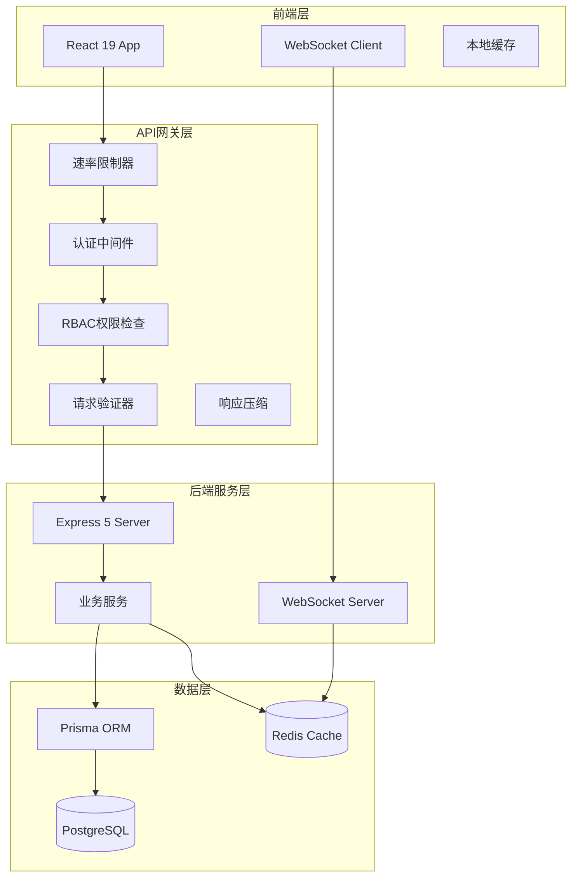
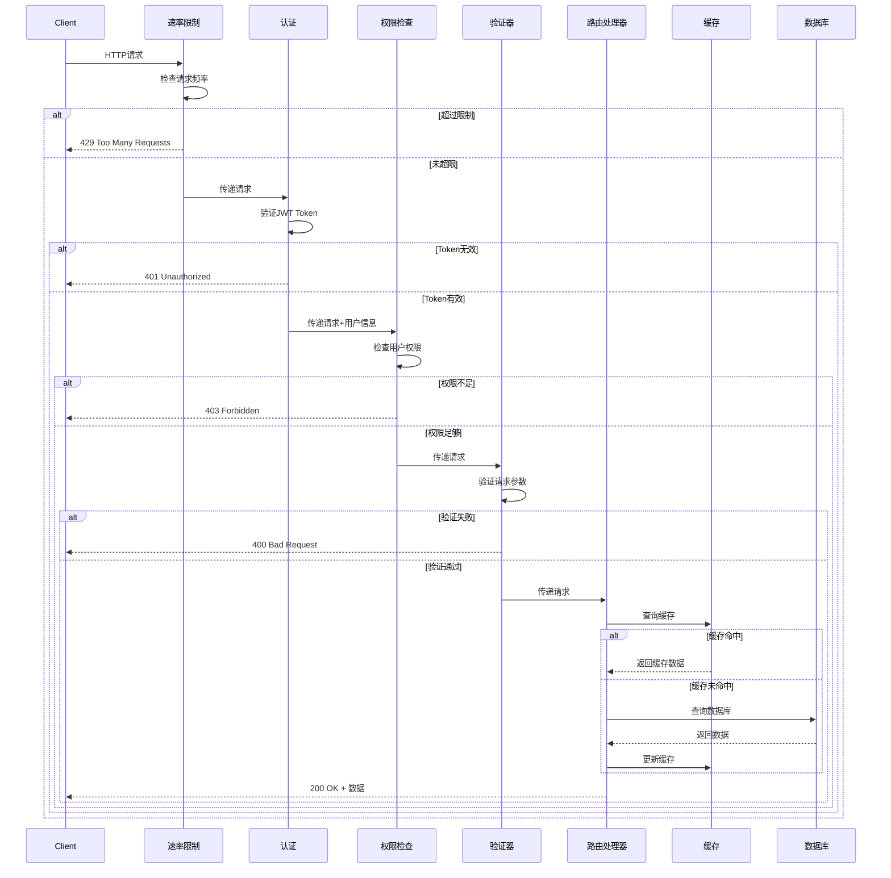

# 设计文档

## 概述

本设计文档详细描述了智能股票分析网站项目审查与升级的技术实现方案。升级工作分为四个优先级阶段：P0（严重问题）、P1（中等问题）、P2（轻微问题）和P3（性能优化）。

## 架构

### 整体架构图




### 中间件管道架构



## 组件和接口

### 1. 速率限制器 (Rate Limiter)

**文件位置**: `backend/src/middleware/rateLimit.ts`

```typescript
interface RateLimitConfig {
  windowMs: number;        // 时间窗口（毫秒）
  maxRequests: number;     // 最大请求数
  keyGenerator?: (req: Request) => string;  // 键生成函数
  skipFailedRequests?: boolean;  // 是否跳过失败请求
  skipSuccessfulRequests?: boolean;  // 是否跳过成功请求
}

interface RateLimitInfo {
  limit: number;
  remaining: number;
  resetTime: Date;
}

// 速率限制中间件工厂
function createRateLimiter(config: RateLimitConfig): RequestHandler;

// 预定义的限制器
const publicApiLimiter: RequestHandler;      // 100次/分钟
const authenticatedApiLimiter: RequestHandler; // 200次/分钟
const strictApiLimiter: RequestHandler;       // 10次/分钟（敏感操作）
```


### 2. RBAC权限系统

**文件位置**: `backend/src/middleware/rbac.ts`, `backend/src/types/roles.ts`

```typescript
// 用户角色枚举
enum UserRole {
  USER = 'user',           // 普通用户
  PREMIUM = 'premium',     // 高级用户
  ADMIN = 'admin'          // 管理员
}

// 权限枚举
enum Permission {
  READ_STOCKS = 'read:stocks',
  READ_PORTFOLIO = 'read:portfolio',
  WRITE_PORTFOLIO = 'write:portfolio',
  READ_WATCHLIST = 'read:watchlist',
  WRITE_WATCHLIST = 'write:watchlist',
  READ_ANALYSIS = 'read:analysis',
  WRITE_ANALYSIS = 'write:analysis',
  ADMIN_USERS = 'admin:users',
  ADMIN_SYSTEM = 'admin:system'
}

// 角色权限映射
const rolePermissions: Record<UserRole, Permission[]>;

// RBAC中间件
function requirePermission(...permissions: Permission[]): RequestHandler;
function requireRole(...roles: UserRole[]): RequestHandler;
```

### 3. 缓存管理器

**文件位置**: `backend/src/lib/cache-manager.ts`

```typescript
interface CacheOptions {
  ttl?: number;           // 过期时间（秒）
  prefix?: string;        // 键前缀
  serialize?: boolean;    // 是否序列化
}

interface CacheManager {
  // 基础操作
  get<T>(key: string): Promise<T | null>;
  set<T>(key: string, value: T, options?: CacheOptions): Promise<void>;
  del(key: string): Promise<void>;
  
  // 高级操作
  getOrSet<T>(key: string, factory: () => Promise<T>, options?: CacheOptions): Promise<T>;
  invalidatePattern(pattern: string): Promise<void>;
  
  // 缓存键生成
  generateKey(prefix: string, params: Record<string, unknown>): string;
  
  // 监控
  getStats(): Promise<CacheStats>;
}

interface CacheStats {
  hits: number;
  misses: number;
  hitRate: number;
  memoryUsage: number;
}
```


### 4. WebSocket管理器增强

**文件位置**: `backend/src/lib/socket.ts`, `frontend/src/lib/websocket.ts`

```typescript
// 后端WebSocket配置
interface WebSocketConfig {
  pingInterval: number;    // 心跳间隔（毫秒）
  pingTimeout: number;     // 心跳超时（毫秒）
  maxReconnectAttempts: number;
  reconnectInterval: number;
}

// 消息队列接口
interface MessageQueue {
  enqueue(userId: string, message: QueuedMessage): Promise<void>;
  dequeue(userId: string): Promise<QueuedMessage[]>;
  getQueueSize(userId: string): Promise<number>;
}

interface QueuedMessage {
  id: string;
  event: string;
  data: unknown;
  timestamp: Date;
  expiresAt: Date;
}

// 前端WebSocket客户端
interface WebSocketClient {
  connect(): void;
  disconnect(): void;
  subscribe(channel: string): void;
  unsubscribe(channel: string): void;
  on(event: string, handler: (data: unknown) => void): void;
  off(event: string, handler?: (data: unknown) => void): void;
  
  // 状态
  isConnected: boolean;
  reconnectAttempts: number;
}
```

### 5. 统一错误处理

**文件位置**: `backend/src/middleware/errorHandler.ts`

```typescript
// 错误响应格式
interface ErrorResponse {
  success: false;
  error: {
    code: string;
    message: string;
    details?: Record<string, unknown>;
    timestamp: string;
    requestId: string;
  };
}

// 自定义错误类
class AppError extends Error {
  constructor(
    public code: string,
    public message: string,
    public statusCode: number,
    public details?: Record<string, unknown>
  ) {
    super(message);
  }
}

// 预定义错误
class ValidationError extends AppError { statusCode = 400; }
class UnauthorizedError extends AppError { statusCode = 401; }
class ForbiddenError extends AppError { statusCode = 403; }
class NotFoundError extends AppError { statusCode = 404; }
class RateLimitError extends AppError { statusCode = 429; }
class InternalError extends AppError { statusCode = 500; }
```


### 6. 前端API客户端增强

**文件位置**: `frontend/src/services/api.ts`

```typescript
interface ApiClientConfig {
  baseURL: string;
  timeout: number;
  retryAttempts: number;
  retryDelay: number;
}

interface RequestConfig {
  timeout?: number;
  retryable?: boolean;
  cache?: boolean;
  cacheTTL?: number;
}

// 增强的API客户端
interface EnhancedApiClient {
  get<T>(url: string, config?: RequestConfig): Promise<T>;
  post<T>(url: string, data?: unknown, config?: RequestConfig): Promise<T>;
  put<T>(url: string, data?: unknown, config?: RequestConfig): Promise<T>;
  delete<T>(url: string, config?: RequestConfig): Promise<T>;
  
  // 请求拦截器
  addRequestInterceptor(interceptor: RequestInterceptor): void;
  addResponseInterceptor(interceptor: ResponseInterceptor): void;
  
  // 取消请求
  cancelRequest(requestId: string): void;
  cancelAllRequests(): void;
}
```

## 数据模型

### 用户角色扩展

```prisma
// 扩展User模型
model User {
  id            String    @id @default(uuid())
  email         String    @unique
  passwordHash  String
  role          UserRole  @default(USER)
  permissions   String[]  @default([])  // 额外权限
  createdAt     DateTime  @default(now())
  updatedAt     DateTime  @updatedAt
  lastLoginAt   DateTime?
  
  // 关联
  watchlists    Watchlist[]
  portfolios    Portfolio[]
  auditLogs     AuditLog[]
}

enum UserRole {
  USER
  PREMIUM
  ADMIN
}

// 审计日志
model AuditLog {
  id          String   @id @default(uuid())
  userId      String
  action      String
  resource    String
  details     Json?
  ipAddress   String?
  userAgent   String?
  createdAt   DateTime @default(now())
  
  user        User     @relation(fields: [userId], references: [id])
  
  @@index([userId])
  @@index([action])
  @@index([createdAt])
}

// 速率限制记录（可选，用于持久化）
model RateLimitRecord {
  id          String   @id @default(uuid())
  key         String   @unique
  count       Int      @default(0)
  windowStart DateTime
  expiresAt   DateTime
  
  @@index([expiresAt])
}
```


### 配置模型

```typescript
// 外部配置文件结构
interface AppConfig {
  rateLimit: {
    public: { windowMs: number; maxRequests: number };
    authenticated: { windowMs: number; maxRequests: number };
    strict: { windowMs: number; maxRequests: number };
  };
  
  cache: {
    defaultTTL: number;
    maxMemory: string;
    preloadKeys: string[];
  };
  
  websocket: {
    pingInterval: number;
    pingTimeout: number;
    maxReconnectAttempts: number;
    messageQueueTTL: number;
  };
  
  heatmap: {
    marketCapTiers: {
      mega: number;    // > 200B
      large: number;   // > 10B
      mid: number;     // > 2B
      small: number;   // > 300M
      micro: number;   // <= 300M
    };
    hideZeroPriceDefault: boolean;
  };
  
  etfProxyMapping: Record<string, string>;
}
```

### 数据库索引优化

```sql
-- 热力图查询优化索引
CREATE INDEX idx_stock_sector_marketcap ON "Stock" (sector, "marketCap" DESC);
CREATE INDEX idx_stock_industry_marketcap ON "Stock" (industry, "marketCap" DESC);
CREATE INDEX idx_stock_quote_symbol_timestamp ON "StockQuote" (symbol, timestamp DESC);

-- 用户查询优化索引
CREATE INDEX idx_user_role ON "User" (role);
CREATE INDEX idx_audit_log_user_action ON "AuditLog" ("userId", action, "createdAt" DESC);

-- 缓存相关索引
CREATE INDEX idx_rate_limit_expires ON "RateLimitRecord" ("expiresAt");
```


## 正确性属性

*正确性属性是一种特征或行为，应该在系统的所有有效执行中保持为真——本质上是关于系统应该做什么的形式化陈述。属性作为人类可读规范和机器可验证正确性保证之间的桥梁。*

### Property 1: 速率限制正确性

*对于任何* IP地址或认证用户，当在配置的时间窗口内发送的请求数量超过配置的最大值时，后续请求应该返回429状态码，且响应头应包含 X-RateLimit-Limit、X-RateLimit-Remaining 和 X-RateLimit-Reset 字段。

**Validates: Requirements 1.2, 1.3, 1.5**

### Property 2: RBAC权限验证正确性

*对于任何* 用户和任何受保护资源，当用户尝试访问该资源时，系统应该正确验证用户权限：如果用户具有所需权限则允许访问，否则返回403状态码和明确的错误信息。

**Validates: Requirements 2.2, 2.4**

### Property 3: 角色修改即时生效

*对于任何* 用户角色修改操作，修改后用户的新权限应该立即生效，且系统应该记录包含操作详情的审计日志。

**Validates: Requirements 2.6**

### Property 4: 零价股票过滤正确性

*对于任何* 包含零价股票的数据集，当 hideZeroPrice 参数为 true 时，返回的结果集不应包含任何价格为零或null的股票。

**Validates: Requirements 3.2, 3.4**

### Property 5: 缓存键确定性

*对于任何* 相同的输入参数（包括过滤器对象），无论属性顺序如何，缓存键生成算法应该始终生成相同的键，且键长度应该在合理范围内（通过哈希处理）。

**Validates: Requirements 4.1, 4.2, 4.3, 4.4**

### Property 6: WebSocket重连指数退避

*对于任何* 断开的WebSocket连接，客户端的重连间隔应该按指数增长（如1s, 2s, 4s, 8s...），直到达到最大重连次数或成功连接。

**Validates: Requirements 5.3**

### Property 7: 离线消息持久化和投递

*对于任何* 用户离线期间收到的消息，消息应该被持久化到队列中；当用户重新连接时，所有缓存的消息应该按顺序被投递。

**Validates: Requirements 5.4, 5.5**

### Property 8: 统一错误响应格式

*对于任何* API错误响应，响应体应该包含 success: false、error.code、error.message 和 error.timestamp 字段，且HTTP状态码应该正确反映错误类型（4xx为客户端错误，5xx为服务器错误）。

**Validates: Requirements 6.1, 6.2, 6.5**

### Property 9: 缓存失败容错

*对于任何* 缓存读写失败的情况，API请求应该继续正常处理并返回正确的结果，而不是返回错误。

**Validates: Requirements 6.4**

### Property 10: 内部错误信息隐藏

*对于任何* 服务器内部错误（500），响应中不应包含堆栈跟踪、数据库查询、文件路径等敏感的内部实现细节。

**Validates: Requirements 6.6**

### Property 11: 大结果集分页

*对于任何* 返回大量数据的查询，当结果集超过配置的阈值时，应该支持分页参数（page, limit），且返回的数据量不应超过配置的最大值。

**Validates: Requirements 7.3**

### Property 12: 请求超时处理

*对于任何* 超过配置超时时间的API请求，请求应该被自动取消，且客户端应该收到友好的超时提示信息。

**Validates: Requirements 8.2, 8.4**

### Property 13: 缓存失效正确性

*对于任何* 数据更新操作，相关的缓存条目应该被主动失效，确保后续请求获取到最新数据。

**Validates: Requirements 12.2, 12.3**

### Property 14: 响应压缩

*对于任何* 支持压缩的客户端请求（Accept-Encoding包含gzip或br），响应应该被压缩，且Content-Encoding头应该正确设置。

**Validates: Requirements 14.1**

### Property 15: 条件请求处理

*对于任何* 包含 If-None-Match 或 If-Modified-Since 头的请求，如果资源未发生变化，应该返回304状态码而不是完整的响应体。

**Validates: Requirements 14.3, 14.4**

### Property 16: 字段选择

*对于任何* 包含字段选择参数的请求，响应应该只包含请求的字段，不应包含未请求的字段。

**Validates: Requirements 14.5**


## 错误处理

### 错误分类和处理策略

| 错误类型 | HTTP状态码 | 处理策略 | 用户提示 |
|---------|-----------|---------|---------|
| 验证错误 | 400 | 返回详细的字段错误信息 | 显示具体的验证失败原因 |
| 认证失败 | 401 | 清除本地token，重定向到登录 | "请重新登录" |
| 权限不足 | 403 | 记录审计日志 | "您没有权限执行此操作" |
| 资源不存在 | 404 | 返回空结果或错误 | "未找到请求的资源" |
| 速率限制 | 429 | 返回重试时间 | "请求过于频繁，请稍后重试" |
| 服务器错误 | 500 | 记录详细日志，返回通用错误 | "服务器繁忙，请稍后重试" |
| 网络超时 | - | 自动重试或提示用户 | "网络连接超时，请检查网络" |

### 错误恢复机制

```typescript
// 前端错误恢复策略
interface ErrorRecoveryStrategy {
  // 自动重试配置
  retry: {
    maxAttempts: number;
    retryableStatuses: number[];  // [408, 429, 500, 502, 503, 504]
    backoffMultiplier: number;
  };
  
  // 降级策略
  fallback: {
    useCache: boolean;      // 使用缓存数据
    showStaleData: boolean; // 显示过期数据
    offlineMode: boolean;   // 离线模式
  };
  
  // 用户通知
  notification: {
    showToast: boolean;
    autoHide: boolean;
    hideDelay: number;
  };
}
```

## 测试策略

### 测试类型和覆盖范围

#### 单元测试
- 速率限制器逻辑测试
- RBAC权限检查逻辑测试
- 缓存键生成算法测试
- 错误处理中间件测试
- 数据验证器测试

#### 属性测试
- 速率限制正确性（Property 1）
- RBAC权限验证（Property 2, 3）
- 零价股票过滤（Property 4）
- 缓存键确定性（Property 5）
- WebSocket重连（Property 6）
- 消息持久化（Property 7）
- 错误响应格式（Property 8, 9, 10）
- 分页正确性（Property 11）
- 超时处理（Property 12）
- 缓存失效（Property 13）
- 响应压缩（Property 14）
- 条件请求（Property 15）
- 字段选择（Property 16）

#### 集成测试
- API端点完整流程测试
- WebSocket连接和消息传递测试
- 数据库查询性能测试
- 缓存命中和失效测试

#### 安全测试
- 认证绕过测试
- 权限提升测试
- 速率限制绕过测试
- SQL注入测试
- XSS测试

### 测试配置

```typescript
// 属性测试配置
const propertyTestConfig = {
  numRuns: 100,           // 每个属性测试运行100次
  seed: undefined,        // 随机种子（可选）
  verbose: true,          // 详细输出
  endOnFailure: true,     // 失败时停止
};

// 测试标签格式
// Feature: project-review-and-upgrade, Property N: [属性描述]
```

### 测试工具选择

- **后端单元测试**: Jest
- **后端属性测试**: fast-check
- **前端单元测试**: Vitest
- **前端属性测试**: fast-check
- **集成测试**: Supertest + Jest
- **E2E测试**: Playwright
- **性能测试**: k6 或 Artillery
- **安全测试**: OWASP ZAP

