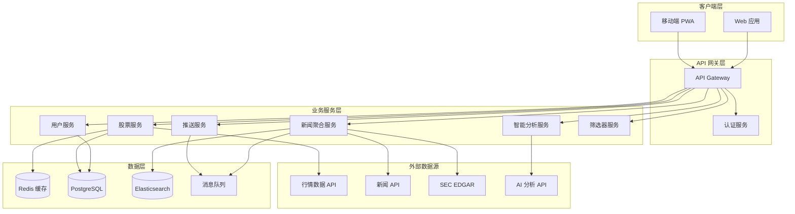
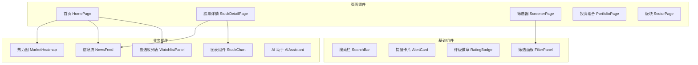

# 设计文档

## 概述

智能股票分析网站（Smart Stock Analyzer）采用现代化的前后端分离架构，结合实时数据推送、智能分析引擎和丰富的可视化组件，为个人投资者提供一站式智能投资助手服务。

系统核心设计理念：
- **信息聚合**：从多个数据源收集股票新闻、财报、内部交易等信息
- **智能分析**：利用 AI 技术分析信息对股价的潜在影响
- **实时推送**：通过 WebSocket 实现信息的实时推送
- **可视化呈现**：通过热力图、K线图、时间轴等直观展示数据
- **个性化服务**：基于用户偏好提供定制化的信息筛选和推送

## 架构

### 系统架构图



### 技术栈选型

| 层级 | 技术选型 | 说明 |
|------|----------|------|
| 前端 | React + TypeScript | 组件化开发，类型安全 |
| 状态管理 | Zustand | 轻量级状态管理 |
| 图表库 | TradingView Lightweight Charts + ECharts | 专业金融图表 |
| 后端框架 | Node.js + Express | 高性能异步处理 |
| 实时通信 | Socket.IO | WebSocket 实时推送 |
| 数据库 | PostgreSQL | 关系型数据存储 |
| 缓存 | Redis | 行情数据缓存 |
| 搜索引擎 | Elasticsearch | 新闻全文搜索 |
| 消息队列 | Redis Pub/Sub | 事件驱动架构 |
| AI 服务 | OpenAI API | 智能分析和总结 |

## 组件与接口

### 前端组件架构



### 核心服务接口

#### 用户服务 (UserService)

```typescript
interface UserService {
  // 用户注册
  register(email: string, password: string): Promise<User>;
  
  // 用户登录
  login(email: string, password: string): Promise<AuthToken>;
  
  // 获取用户设置
  getSettings(userId: string): Promise<UserSettings>;
  
  // 更新用户设置
  updateSettings(userId: string, settings: Partial<UserSettings>): Promise<UserSettings>;
}
```

#### 自选股服务 (WatchlistService)

```typescript
interface WatchlistService {
  // 获取自选股列表
  getWatchlist(userId: string): Promise<WatchlistItem[]>;
  
  // 添加自选股
  addStock(userId: string, symbol: string): Promise<WatchlistItem>;
  
  // 移除自选股
  removeStock(userId: string, symbol: string): Promise<void>;
  
  // 更新排序
  reorderStocks(userId: string, symbols: string[]): Promise<void>;
}
```

#### 股票服务 (StockService)

```typescript
interface StockService {
  // 搜索股票
  searchStocks(query: string): Promise<StockSearchResult[]>;
  
  // 获取股票详情
  getStockDetail(symbol: string): Promise<StockDetail>;
  
  // 获取股票行情
  getQuote(symbol: string): Promise<StockQuote>;
  
  // 获取历史数据
  getHistoricalData(symbol: string, range: TimeRange): Promise<OHLCV[]>;
  
  // 获取量化评级
  getQuantRating(symbol: string): Promise<QuantRating>;
}
```

#### 新闻聚合服务 (NewsService)

```typescript
interface NewsService {
  // 获取股票相关新闻
  getStockNews(symbol: string, options: PaginationOptions): Promise<NewsItem[]>;
  
  // 获取板块新闻
  getSectorNews(sector: string, options: PaginationOptions): Promise<NewsItem[]>;
  
  // 搜索新闻
  searchNews(query: string, options: SearchOptions): Promise<NewsItem[]>;
  
  // 获取 SEC 文件
  getSECFilings(symbol: string): Promise<SECFiling[]>;
  
  // 获取财报电话会议记录
  getEarningsTranscript(symbol: string, quarter: string): Promise<Transcript>;
}
```

#### 智能分析服务 (AnalysisService)

```typescript
interface AnalysisService {
  // 分析新闻影响
  analyzeNewsImpact(newsId: string): Promise<ImpactAnalysis>;
  
  // 生成信息摘要
  summarizeNews(newsIds: string[]): Promise<Summary>;
  
  // AI 对话
  chat(userId: string, message: string, context: ChatContext): Promise<AIResponse>;
  
  // 股票对比分析
  compareStocks(symbols: string[]): Promise<ComparisonReport>;
}
```

#### 推送服务 (PushService)

```typescript
interface PushService {
  // 订阅股票更新
  subscribeStock(userId: string, symbol: string): Promise<void>;
  
  // 取消订阅
  unsubscribeStock(userId: string, symbol: string): Promise<void>;
  
  // 设置价格提醒
  setPriceAlert(userId: string, alert: PriceAlert): Promise<void>;
  
  // 获取用户提醒
  getAlerts(userId: string): Promise<Alert[]>;
}
```

#### 筛选器服务 (ScreenerService)

```typescript
interface ScreenerService {
  // 执行筛选
  screen(filters: ScreenerFilters): Promise<ScreenerResult>;
  
  // 保存筛选模板
  saveTemplate(userId: string, template: ScreenerTemplate): Promise<void>;
  
  // 获取筛选模板
  getTemplates(userId: string): Promise<ScreenerTemplate[]>;
}
```

## 数据模型

### 用户相关

```typescript
interface User {
  id: string;
  email: string;
  passwordHash: string;
  createdAt: Date;
  updatedAt: Date;
}

interface UserSettings {
  userId: string;
  theme: 'light' | 'dark' | 'system';
  language: 'zh' | 'en';
  timezone: string;
  pushEnabled: boolean;
  quietHoursStart: string | null;  // HH:mm 格式
  quietHoursEnd: string | null;
  priceAlertThreshold: number;     // 默认价格波动提醒阈值 (%)
  investmentPreferences: string[]; // 投资偏好标签
}

interface WatchlistItem {
  userId: string;
  symbol: string;
  addedAt: Date;
  sortOrder: number;
  notes: string | null;
}
```

### 股票相关

```typescript
interface Stock {
  symbol: string;
  name: string;
  exchange: string;
  sector: string;
  industry: string;
  marketCap: number;
  country: string;
}

interface StockQuote {
  symbol: string;
  price: number;
  change: number;
  changePercent: number;
  volume: number;
  avgVolume: number;
  high: number;
  low: number;
  open: number;
  previousClose: number;
  timestamp: Date;
}

interface OHLCV {
  timestamp: Date;
  open: number;
  high: number;
  low: number;
  close: number;
  volume: number;
}

interface QuantRating {
  symbol: string;
  overallRating: 'strong_buy' | 'buy' | 'hold' | 'sell' | 'strong_sell';
  overallScore: number;           // 1-5 分
  valuationScore: number;
  growthScore: number;
  profitabilityScore: number;
  momentumScore: number;
  revisionsScore: number;
  sectorRank: number;
  industryRank: number;
  updatedAt: Date;
}

interface FundamentalMetrics {
  symbol: string;
  pe: number | null;
  forwardPe: number | null;
  peg: number | null;
  ps: number | null;
  pb: number | null;
  eps: number | null;
  epsGrowth: number | null;
  revenue: number | null;
  revenueGrowth: number | null;
  grossMargin: number | null;
  operatingMargin: number | null;
  netMargin: number | null;
  roe: number | null;
  roa: number | null;
  debtToEquity: number | null;
  currentRatio: number | null;
  dividendYield: number | null;
  payoutRatio: number | null;
}

interface TechnicalIndicators {
  symbol: string;
  rsi14: number | null;
  macd: { value: number; signal: number; histogram: number } | null;
  sma20: number | null;
  sma50: number | null;
  sma200: number | null;
  ema12: number | null;
  ema26: number | null;
  bollingerBands: { upper: number; middle: number; lower: number } | null;
  atr14: number | null;
  adx14: number | null;
}
```

### 新闻与分析

```typescript
interface NewsItem {
  id: string;
  title: string;
  summary: string;
  content: string;
  source: string;
  sourceCredibility: 'high' | 'medium' | 'low';
  url: string;
  publishedAt: Date;
  symbols: string[];
  sectors: string[];
  impactAnalysis: ImpactAnalysis | null;
}

interface ImpactAnalysis {
  newsId: string;
  direction: 'bullish' | 'bearish' | 'neutral';
  magnitude: 'high' | 'medium' | 'low';
  confidence: number;             // 0-1
  summary: string;
  keyPoints: string[];
  historicalComparison: string | null;
  analyzedAt: Date;
}

interface SECFiling {
  id: string;
  symbol: string;
  formType: string;               // 10-K, 10-Q, 8-K, etc.
  filedAt: Date;
  periodOfReport: Date | null;
  url: string;
  summary: string | null;
}

interface Transcript {
  id: string;
  symbol: string;
  quarter: string;                // Q1 2024
  eventType: 'earnings' | 'investor_day' | 'conference';
  date: Date;
  participants: TranscriptParticipant[];
  sections: TranscriptSection[];
  aiSummary: string | null;
}

interface TranscriptParticipant {
  name: string;
  title: string;
  company: string;
}

interface TranscriptSection {
  type: 'prepared_remarks' | 'qa';
  speaker: string;
  content: string;
}
```

### 财报与股息

```typescript
interface EarningsEvent {
  symbol: string;
  reportDate: Date;
  fiscalQuarter: string;
  fiscalYear: number;
  timing: 'bmo' | 'amc' | 'unknown';  // Before Market Open / After Market Close
  epsEstimate: number | null;
  epsActual: number | null;
  epsSurprise: number | null;
  revenueEstimate: number | null;
  revenueActual: number | null;
  revenueSurprise: number | null;
}

interface DividendEvent {
  symbol: string;
  exDate: Date;
  payDate: Date;
  recordDate: Date;
  amount: number;
  frequency: 'annual' | 'semi_annual' | 'quarterly' | 'monthly';
  yield: number;
}

interface InsiderTrade {
  id: string;
  symbol: string;
  filedAt: Date;
  tradeDate: Date;
  insiderName: string;
  insiderTitle: string;
  transactionType: 'buy' | 'sell' | 'exercise';
  shares: number;
  pricePerShare: number;
  totalValue: number;
  sharesOwned: number;
}
```

### 筛选器

```typescript
interface ScreenerFilters {
  // 描述性筛选
  exchange?: string[];
  sector?: string[];
  industry?: string[];
  country?: string[];
  marketCapMin?: number;
  marketCapMax?: number;
  
  // 基本面筛选
  peMin?: number;
  peMax?: number;
  epsGrowthMin?: number;
  dividendYieldMin?: number;
  debtToEquityMax?: number;
  
  // 技术面筛选
  rsiMin?: number;
  rsiMax?: number;
  priceAboveSma20?: boolean;
  priceAboveSma50?: boolean;
  priceAboveSma200?: boolean;
  volumeAboveAvg?: boolean;
  
  // 排序
  sortBy?: string;
  sortOrder?: 'asc' | 'desc';
}

interface ScreenerTemplate {
  id: string;
  userId: string;
  name: string;
  description: string | null;
  filters: ScreenerFilters;
  createdAt: Date;
}
```

### 投资组合

```typescript
interface Portfolio {
  id: string;
  userId: string;
  name: string;
  description: string | null;
  createdAt: Date;
}

interface PortfolioHolding {
  portfolioId: string;
  symbol: string;
  shares: number;
  avgCostBasis: number;
  addedAt: Date;
}

interface PortfolioTransaction {
  id: string;
  portfolioId: string;
  symbol: string;
  type: 'buy' | 'sell' | 'dividend';
  shares: number;
  pricePerShare: number;
  totalAmount: number;
  transactionDate: Date;
  notes: string | null;
}
```

### 提醒与推送

```typescript
interface Alert {
  id: string;
  userId: string;
  type: 'price' | 'news' | 'earnings' | 'dividend' | 'insider' | 'rating';
  symbol: string | null;
  sector: string | null;
  title: string;
  message: string;
  priority: 'high' | 'medium' | 'low';
  read: boolean;
  createdAt: Date;
  metadata: Record<string, unknown>;
}

interface PriceAlert {
  id: string;
  userId: string;
  symbol: string;
  condition: 'above' | 'below' | 'change_percent';
  targetValue: number;
  triggered: boolean;
  triggeredAt: Date | null;
  createdAt: Date;
}
```

### 板块

```typescript
interface Sector {
  id: string;
  name: string;
  nameZh: string;
  description: string;
  stockCount: number;
}

interface SectorSubscription {
  userId: string;
  sectorId: string;
  subscribedAt: Date;
}
```


## 正确性属性

*正确性属性是指在系统所有有效执行中都应保持为真的特征或行为——本质上是关于系统应该做什么的形式化陈述。属性作为人类可读规范和机器可验证正确性保证之间的桥梁。*

### Property 1: 搜索匹配属性

*For any* 搜索查询字符串和股票数据库，搜索返回的所有股票的代码或名称都应包含查询字符串（不区分大小写）

**Validates: Requirements 1.1**

### Property 2: 自选股增删属性

*For any* 用户和股票，添加股票后自选股列表应包含该股票且长度增加1；移除股票后自选股列表不应包含该股票且长度减少1

**Validates: Requirements 1.2, 1.3**

### Property 3: 自选股排序属性

*For any* 用户自选股列表和新的排序顺序，重新排序后获取的列表顺序应与指定顺序一致

**Validates: Requirements 1.6**

### Property 4: 价格波动推送属性

*For any* 用户设定的价格阈值和股票价格变化，当价格变化百分比超过阈值时应触发推送，未超过时不应触发

**Validates: Requirements 2.3**

### Property 5: 免打扰时段属性

*For any* 用户设定的免打扰时段和推送事件，在免打扰时段内的推送应被暂停，时段外的推送应正常发送

**Validates: Requirements 2.6**

### Property 6: 离线消息缓存属性

*For any* 用户离线期间产生的推送消息，用户上线后应能获取所有缓存的消息，且消息内容完整

**Validates: Requirements 2.5**

### Property 7: 影响分析完整性属性

*For any* 新闻分析结果，应包含有效的影响方向（bullish/bearish/neutral）、影响程度（high/medium/low）和置信度（0-1之间）

**Validates: Requirements 3.1, 3.2**

### Property 8: 低置信度标注属性

*For any* 置信度低于阈值（如0.6）的分析结果，应明确标注为低置信度

**Validates: Requirements 3.6**

### Property 9: 时间范围数据属性

*For any* 股票和时间范围，返回的历史数据应仅包含该时间范围内的数据点，且数据点按时间升序排列

**Validates: Requirements 4.3**

### Property 10: 信息流排序属性

*For any* 信息流列表，应按优先级降序排列，相同优先级按时间降序排列

**Validates: Requirements 6.4**

### Property 11: 用户设置持久化属性（Round-trip）

*For any* 用户设置，保存后再读取应得到相同的设置值

**Validates: Requirements 7.2, 7.3**

### Property 12: 筛选器过滤属性

*For any* 筛选条件组合和股票数据库，返回的所有股票都应满足所有指定的筛选条件

**Validates: Requirements 10.2, 10.3, 10.4, 10.5**

### Property 13: 筛选结果排序属性

*For any* 筛选结果和排序条件，返回的股票列表应按指定字段和顺序正确排序

**Validates: Requirements 10.7**

### Property 14: 筛选模板持久化属性（Round-trip）

*For any* 筛选模板，保存后再加载应得到相同的筛选条件

**Validates: Requirements 10.6**

### Property 15: 财报日历时间属性

*For any* 财报事件，应包含有效的报告日期和发布时间（bmo/amc/unknown）

**Validates: Requirements 11.1, 11.2**

### Property 16: 事件触发推送属性

*For any* 自选股的重大事件（财报、内部交易、评级变化、股息变化、SEC文件），应触发相应类型的推送通知

**Validates: Requirements 11.4, 12.3, 13.6, 14.4, 15.5, 19.3, 20.2**

### Property 17: 内部交易数据完整性属性

*For any* 内部交易记录，应包含交易人身份、职位、交易类型、数量、价格和总价值

**Validates: Requirements 12.1, 12.2, 12.4**

### Property 18: 内部交易趋势计算属性

*For any* 股票的内部交易记录集合，净买入/卖出趋势应等于买入总量减去卖出总量

**Validates: Requirements 12.6**

### Property 19: 量化评级计算属性

*For any* 股票的量化评级，综合评级应基于估值、成长性、盈利能力、动量和修正因子的加权计算得出

**Validates: Requirements 13.1, 13.2**

### Property 20: 量化评级排名属性

*For any* 板块或行业内的股票集合，排名应与综合评分的降序排列一致

**Validates: Requirements 13.4**

### Property 21: 会议记录搜索属性

*For any* 搜索关键词和会议记录集合，返回的记录应包含该关键词

**Validates: Requirements 14.3**

### Property 22: 股息收入计算属性

*For any* 投资组合持仓，预期年度股息收入应等于各持仓股数乘以年度股息的总和

**Validates: Requirements 15.6**

### Property 23: 技术指标计算属性

*For any* 股票历史数据和指标参数，计算的技术指标值应符合标准公式（如RSI、MACD、布林带）

**Validates: Requirements 16.1, 16.4**

### Property 24: 技术信号触发属性

*For any* 技术指标值和用户设定的信号条件，当指标值满足条件时应触发提醒

**Validates: Requirements 16.5**

### Property 25: 投资组合市值计算属性

*For any* 投资组合，总市值应等于各持仓股数乘以当前价格的总和

**Validates: Requirements 17.2**

### Property 26: 投资组合收益计算属性

*For any* 投资组合持仓，收益应等于（当前价格 - 平均成本）乘以股数

**Validates: Requirements 17.3**

### Property 27: 投资组合板块分布属性

*For any* 投资组合，各板块占比之和应等于100%

**Validates: Requirements 17.5**

### Property 28: 热力图数据属性

*For any* 热力图数据，每个股票的涨跌幅应与其实际价格变化一致

**Validates: Requirements 18.2**

### Property 29: 排行榜排序属性

*For any* 涨幅榜/跌幅榜/成交量榜，股票应按对应指标正确排序

**Validates: Requirements 18.5**

### Property 30: AI指令解析属性

*For any* 有效的自然语言添加自选股指令，AI应正确识别股票代码并执行添加操作

**Validates: Requirements 9.1, 9.2**

### Property 31: 新闻去重属性

*For any* 来自多个信息源的相同新闻，聚合后应只保留一条并标注所有来源

**Validates: Requirements 8.2**

### Property 32: SEC文件筛选属性

*For any* 文件类型和日期范围筛选条件，返回的SEC文件应满足所有条件

**Validates: Requirements 20.5**

## 错误处理

### 网络错误处理

| 错误场景 | 处理策略 | 用户提示 |
|----------|----------|----------|
| API 请求超时 | 自动重试3次，指数退避 | "网络连接较慢，正在重试..." |
| 数据源不可用 | 切换到备用数据源 | "正在切换数据源..." |
| WebSocket 断开 | 自动重连，最多5次 | "连接已断开，正在重新连接..." |
| 请求频率限制 | 队列化请求，延迟执行 | "请求过于频繁，请稍后再试" |

### 数据错误处理

| 错误场景 | 处理策略 | 用户提示 |
|----------|----------|----------|
| 股票代码不存在 | 返回空结果 | "未找到该股票" |
| 数据格式异常 | 记录日志，跳过异常数据 | 静默处理，不影响其他数据 |
| 历史数据缺失 | 显示可用数据，标注缺失 | "部分历史数据暂不可用" |
| 实时行情延迟 | 显示最后更新时间 | "数据更新于 X 分钟前" |

### 用户操作错误处理

| 错误场景 | 处理策略 | 用户提示 |
|----------|----------|----------|
| 添加重复自选股 | 阻止操作 | "该股票已在自选股列表中" |
| 无效筛选条件 | 高亮错误字段 | "请检查筛选条件" |
| 登录失败 | 显示具体原因 | "邮箱或密码错误" |
| 权限不足 | 引导升级或登录 | "请登录以使用此功能" |

### AI 服务错误处理

| 错误场景 | 处理策略 | 用户提示 |
|----------|----------|----------|
| AI 服务不可用 | 降级到基础功能 | "智能分析暂时不可用" |
| 分析超时 | 返回部分结果 | "分析正在进行中，请稍后查看" |
| 无法理解指令 | 请求澄清 | "我不太理解您的意思，您是想..." |
| 置信度过低 | 明确标注 | "此分析仅供参考，建议自行判断" |

## 测试策略

### 测试方法概述

本项目采用双重测试方法：
- **单元测试**：验证具体示例、边界情况和错误条件
- **属性测试**：验证所有输入的通用属性

两种方法互补，共同提供全面的测试覆盖。

### 单元测试

单元测试聚焦于：
- 具体示例验证正确行为
- 组件间集成点
- 边界情况和错误条件

**测试框架**：Jest + React Testing Library

**覆盖范围**：
- 服务层业务逻辑
- 数据模型验证
- API 端点响应
- 前端组件渲染

### 属性测试

属性测试聚焦于：
- 所有输入的通用属性
- 通过随机化实现全面输入覆盖

**测试框架**：fast-check（TypeScript 属性测试库）

**配置要求**：
- 每个属性测试最少运行 100 次迭代
- 每个测试必须用注释引用设计文档中的属性
- 标签格式：**Feature: smart-stock-analyzer, Property {number}: {property_text}**

### 属性测试实现示例

```typescript
import fc from 'fast-check';

// Feature: smart-stock-analyzer, Property 2: 自选股增删属性
describe('Watchlist add/remove operations', () => {
  it('should increase list length by 1 when adding a stock', () => {
    fc.assert(
      fc.property(
        fc.array(fc.string()),  // 初始自选股列表
        fc.string(),             // 要添加的股票
        (initialList, newStock) => {
          fc.pre(!initialList.includes(newStock)); // 前置条件：股票不在列表中
          const result = addStock(initialList, newStock);
          return result.length === initialList.length + 1 && 
                 result.includes(newStock);
        }
      ),
      { numRuns: 100 }
    );
  });

  it('should decrease list length by 1 when removing a stock', () => {
    fc.assert(
      fc.property(
        fc.array(fc.string(), { minLength: 1 }),
        (list) => {
          const stockToRemove = list[0];
          const result = removeStock(list, stockToRemove);
          return result.length === list.length - 1 && 
                 !result.includes(stockToRemove);
        }
      ),
      { numRuns: 100 }
    );
  });
});

// Feature: smart-stock-analyzer, Property 11: 用户设置持久化属性
describe('User settings round-trip', () => {
  it('should preserve settings after save and load', () => {
    fc.assert(
      fc.property(
        fc.record({
          theme: fc.constantFrom('light', 'dark', 'system'),
          language: fc.constantFrom('zh', 'en'),
          pushEnabled: fc.boolean(),
          priceAlertThreshold: fc.float({ min: 0.1, max: 50 })
        }),
        async (settings) => {
          await saveSettings(userId, settings);
          const loaded = await getSettings(userId);
          return deepEqual(settings, loaded);
        }
      ),
      { numRuns: 100 }
    );
  });
});

// Feature: smart-stock-analyzer, Property 12: 筛选器过滤属性
describe('Screener filtering', () => {
  it('should return only stocks matching all filter criteria', () => {
    fc.assert(
      fc.property(
        fc.array(stockArbitrary, { minLength: 10 }),
        screenerFiltersArbitrary,
        (stocks, filters) => {
          const results = applyFilters(stocks, filters);
          return results.every(stock => matchesAllFilters(stock, filters));
        }
      ),
      { numRuns: 100 }
    );
  });
});
```

### 集成测试

**测试范围**：
- API 端点完整流程
- 数据库操作
- 外部服务集成（使用 Mock）
- WebSocket 实时通信

**测试框架**：Supertest + Jest

### 端到端测试

**测试范围**：
- 关键用户流程
- 跨页面导航
- 响应式布局

**测试框架**：Playwright

### 测试覆盖目标

| 测试类型 | 覆盖目标 |
|----------|----------|
| 单元测试 | 80% 代码覆盖率 |
| 属性测试 | 所有正确性属性 |
| 集成测试 | 所有 API 端点 |
| 端到端测试 | 核心用户流程 |
