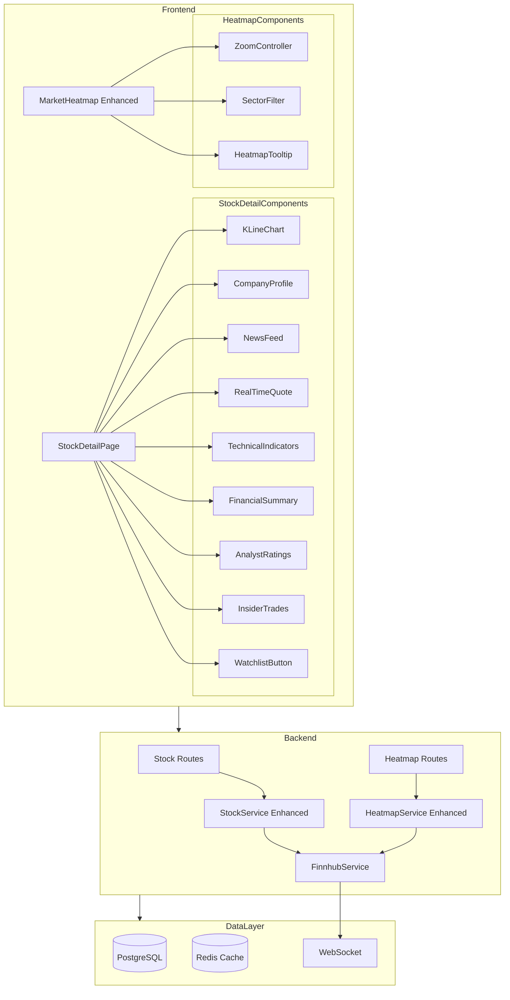

# Design Document: Stock Detail and Heatmap Enhancement

## Overview

本设计文档描述个股详情页（新功能）和市场热力图优化（现有功能改进）的技术实现方案。

**个股详情页**是一个全新的页面组件，整合展示单只股票的完整信息，包括可缩放K线图、公司基本信息、相关新闻、实时报价、技术指标、财务数据、分析师评级、内部交易记录等模块。

**市场热力图优化**是对现有 `MarketHeatmap` 组件的增强，添加缩放功能、修复导航问题、补充完整数据并支持按板块/行业筛选。

技术栈：
- 前端：React + TypeScript + Vite
- 后端：Express + TypeScript + Prisma + PostgreSQL
- 实时数据：Finnhub API + WebSocket
- 缓存：Redis
- 图表库：lightweight-charts (K线图)、ECharts (热力图)

## Architecture



## Components and Interfaces

### 1. StockDetailPage (前端页面组件)

主页面组件，负责整合所有子组件并管理页面状态。

```typescript
// frontend/src/pages/StockDetailPage.tsx

interface StockDetailPageProps {
  // 从路由参数获取
}

interface StockDetailState {
  symbol: string;
  loading: boolean;
  error: string | null;
  stockDetail: StockDetail | null;
  quote: StockQuote | null;
  isInWatchlist: boolean;
}

// 页面路由: /stock/:symbol
```

### 2. KLineChart (K线图组件增强)

增强现有 StockChart 组件，添加更多时间周期支持和缩放功能。

```typescript
// frontend/src/components/KLineChart.tsx

interface KLineChartProps {
  symbol: string;
  className?: string;
  height?: number;
  showVolume?: boolean;
  showIndicators?: boolean;
  onTimeRangeChange?: (range: TimeRange) => void;
}

// 支持的时间周期
type TimeRange = '1D' | '1W' | '1M' | '3M' | '6M' | '1Y' | '5Y' | 'All';

// 缩放配置
interface ZoomConfig {
  minScale: number;  // 最小缩放比例 0.5
  maxScale: number;  // 最大缩放比例 5
  step: number;      // 缩放步长 0.1
}
```

### 3. CompanyProfile (公司基本信息组件)

```typescript
// frontend/src/components/CompanyProfile.tsx

interface CompanyProfileProps {
  symbol: string;
  className?: string;
}

interface CompanyProfileData {
  symbol: string;
  name: string;
  exchange: string;
  sector: string | null;
  industry: string | null;
  marketCap: number | null;
  country: string | null;
  description?: string;
  website?: string;
  employees?: number;
  founded?: string;
}
```

### 4. RealTimeQuote (实时报价组件)

```typescript
// frontend/src/components/RealTimeQuote.tsx

interface RealTimeQuoteProps {
  symbol: string;
  className?: string;
}

interface QuoteData {
  symbol: string;
  price: number;
  change: number;
  changePercent: number;
  open: number;
  high: number;
  low: number;
  previousClose: number;
  volume: number;
  avgVolume: number | null;
  timestamp: string;
}
```

### 5. FinancialSummary (财务数据摘要组件)

```typescript
// frontend/src/components/FinancialSummary.tsx

interface FinancialSummaryProps {
  symbol: string;
  className?: string;
}

interface FinancialMetrics {
  // 估值指标
  pe: number | null;
  forwardPe: number | null;
  peg: number | null;
  ps: number | null;
  pb: number | null;
  
  // 盈利指标
  eps: number | null;
  epsGrowth: number | null;
  
  // 营收指标
  revenue: number | null;
  revenueGrowth: number | null;
  
  // 利润率
  grossMargin: number | null;
  operatingMargin: number | null;
  netMargin: number | null;
  
  // 回报率
  roe: number | null;
  roa: number | null;
  
  // 负债
  debtToEquity: number | null;
  currentRatio: number | null;
  
  // 股息
  dividendYield: number | null;
  payoutRatio: number | null;
}
```

### 6. AnalystRatings (分析师评级组件)

```typescript
// frontend/src/components/AnalystRatings.tsx

interface AnalystRatingsProps {
  symbol: string;
  className?: string;
}

interface AnalystRatingSummary {
  symbol: string;
  totalAnalysts: number;
  strongBuy: number;
  buy: number;
  hold: number;
  sell: number;
  strongSell: number;
  averageTargetPrice: number | null;
  highTargetPrice: number | null;
  lowTargetPrice: number | null;
  currentPrice: number;
  upsidePercent: number | null;
}

interface AnalystRatingItem {
  id: string;
  analyst: string;
  firm: string;
  rating: 'strong_buy' | 'buy' | 'hold' | 'sell' | 'strong_sell';
  targetPrice: number | null;
  previousRating: string | null;
  previousTargetPrice: number | null;
  ratingDate: string;
}
```

### 7. InsiderTrades (内部交易记录组件)

```typescript
// frontend/src/components/InsiderTrades.tsx

interface InsiderTradesProps {
  symbol: string;
  className?: string;
  limit?: number;
}

interface InsiderTrade {
  id: string;
  symbol: string;
  filedAt: string;
  tradeDate: string;
  insiderName: string;
  insiderTitle: string | null;
  transactionType: 'buy' | 'sell' | 'exercise';
  shares: number;
  pricePerShare: number;
  totalValue: number;
  sharesOwned: number | null;
}

interface InsiderTradeSummary {
  symbol: string;
  period: string;  // e.g., "3M", "6M", "1Y"
  totalBuyShares: number;
  totalBuyValue: number;
  totalSellShares: number;
  totalSellValue: number;
  netShares: number;
  netValue: number;
  buyTransactions: number;
  sellTransactions: number;
}
```

### 8. WatchlistButton (自选股按钮组件)

```typescript
// frontend/src/components/WatchlistButton.tsx

interface WatchlistButtonProps {
  symbol: string;
  className?: string;
  onStatusChange?: (isInWatchlist: boolean) => void;
}
```

### 9. MarketHeatmap Enhanced (增强版热力图组件)

```typescript
// frontend/src/components/MarketHeatmap.tsx (增强)

interface MarketHeatmapProps {
  className?: string;
  onStockClick?: (symbol: string) => void;
}

// 新增缩放状态
interface ZoomState {
  scale: number;
  translateX: number;
  translateY: number;
}

// 新增筛选状态
interface FilterState {
  sectors: string[];      // 选中的板块
  industries: string[];   // 选中的行业
  minMarketCap: number | null;
  maxMarketCap: number | null;
}

// 新增分组选项
type HeatmapGroupBy = 'sector' | 'marketCap' | 'industry';
```

### 10. ZoomController (缩放控制器组件)

```typescript
// frontend/src/components/ZoomController.tsx

interface ZoomControllerProps {
  scale: number;
  minScale: number;
  maxScale: number;
  onZoomIn: () => void;
  onZoomOut: () => void;
  onReset: () => void;
  className?: string;
}
```

### 11. SectorFilter (板块筛选器组件)

```typescript
// frontend/src/components/SectorFilter.tsx

interface SectorFilterProps {
  sectors: string[];
  industries: string[];
  selectedSectors: string[];
  selectedIndustries: string[];
  onSectorChange: (sectors: string[]) => void;
  onIndustryChange: (industries: string[]) => void;
  className?: string;
}
```

### 12. Backend API Enhancements

#### 12.1 Stock Detail API

```typescript
// backend/src/routes/stocks.ts (新增端点)

// GET /api/stocks/:symbol/detail
// 获取股票完整详情（整合多个数据源）
interface StockDetailResponse {
  profile: CompanyProfileData;
  quote: QuoteData;
  financials: FinancialMetrics;
  analystRatings: AnalystRatingSummary;
  recentRatings: AnalystRatingItem[];
  insiderSummary: InsiderTradeSummary;
  recentInsiderTrades: InsiderTrade[];
}

// GET /api/stocks/:symbol/financials
// 获取财务数据
interface FinancialsResponse {
  symbol: string;
  metrics: FinancialMetrics;
  updatedAt: string;
}

// GET /api/stocks/:symbol/analyst-ratings
// 获取分析师评级
interface AnalystRatingsResponse {
  summary: AnalystRatingSummary;
  ratings: AnalystRatingItem[];
}

// GET /api/stocks/:symbol/insider-trades
// 获取内部交易记录
interface InsiderTradesResponse {
  summary: InsiderTradeSummary;
  trades: InsiderTrade[];
}
```

#### 12.2 Heatmap API Enhancements

```typescript
// backend/src/routes/stocks.ts (增强端点)

// GET /api/stocks/market/heatmap
// 增强参数支持
interface HeatmapQueryParams {
  groupBy: 'sector' | 'marketCap' | 'industry';
  sectors?: string[];      // 筛选板块
  industries?: string[];   // 筛选行业
  limit?: number;          // 每组股票数量
  minMarketCap?: number;   // 最小市值
  maxMarketCap?: number;   // 最大市值
}

// GET /api/stocks/market/industries
// 获取行业列表
interface IndustriesResponse {
  industries: Array<{
    name: string;
    sector: string;
    stockCount: number;
  }>;
}
```

### 13. Service Layer Enhancements

#### 13.1 StockService Enhancements

```typescript
// backend/src/services/stockService.ts (增强)

class StockService {
  // 新增方法
  async getStockFullDetail(symbol: string): Promise<StockDetailResponse>;
  async getFinancialMetrics(symbol: string): Promise<FinancialMetrics | null>;
  async getAnalystRatingSummary(symbol: string): Promise<AnalystRatingSummary | null>;
  async getInsiderTradeSummary(symbol: string, period: string): Promise<InsiderTradeSummary | null>;
}
```

#### 13.2 HeatmapService Enhancements

```typescript
// backend/src/services/heatmapService.ts (增强)

class HeatmapService {
  // 增强方法
  async getHeatmapData(
    groupBy: 'sector' | 'marketCap' | 'industry',
    filters: {
      sectors?: string[];
      industries?: string[];
      minMarketCap?: number;
      maxMarketCap?: number;
    },
    limit: number
  ): Promise<HeatmapResponse>;
  
  // 新增方法
  async getAvailableIndustries(): Promise<IndustryInfo[]>;
  async getIndustriesBySector(sector: string): Promise<string[]>;
}
```

## Data Models

### 数据库模型（已存在，无需修改）

现有的 Prisma 模型已经支持所需的数据结构：
- `Stock` - 股票基本信息
- `StockQuote` - 实时报价
- `FundamentalMetrics` - 财务指标
- `AnalystRating` - 分析师评级
- `InsiderTrade` - 内部交易
- `NewsItem` - 新闻
- `WatchlistItem` - 自选股

### 缓存策略

```typescript
// backend/src/lib/cache-keys.ts (新增)

const CacheKeys = {
  stock: {
    // 现有
    search: (query: string) => `stock:search:${query}`,
    detail: (symbol: string) => `stock:detail:${symbol}`,
    quote: (symbol: string) => `stock:quote:${symbol}`,
    historical: (symbol: string, range: string) => `stock:historical:${symbol}:${range}`,
    
    // 新增
    fullDetail: (symbol: string) => `stock:fullDetail:${symbol}`,
    financials: (symbol: string) => `stock:financials:${symbol}`,
    analystRatings: (symbol: string) => `stock:analystRatings:${symbol}`,
    insiderTrades: (symbol: string) => `stock:insiderTrades:${symbol}`,
  },
  market: {
    heatmap: (groupBy: string, filters: string) => `market:heatmap:${groupBy}:${filters}`,
    sectors: () => 'market:sectors',
    industries: () => 'market:industries',
  },
};

const CacheTTL = {
  // 现有
  search: 300,      // 5 分钟
  stockDetail: 3600, // 1 小时
  quote: 60,        // 1 分钟
  historical: 300,  // 5 分钟
  
  // 新增
  fullDetail: 300,      // 5 分钟
  financials: 3600,     // 1 小时
  analystRatings: 1800, // 30 分钟
  insiderTrades: 1800,  // 30 分钟
  heatmap: 60,          // 1 分钟
  sectors: 3600,        // 1 小时
  industries: 3600,     // 1 小时
};
```


## Correctness Properties

*A property is a characteristic or behavior that should hold true across all valid executions of a system—essentially, a formal statement about what the system should do. Properties serve as the bridge between human-readable specifications and machine-verifiable correctness guarantees.*

### Property 1: 时间周期数据一致性

*For any* 股票代码和时间周期组合，当用户选择特定时间周期时，API 返回的 K 线数据的时间范围应该与请求的时间周期匹配。

**Validates: Requirements 1.2**

### Property 2: 市值格式化正确性

*For any* 市值数值，格式化函数应该正确转换为易读形式：
- 大于等于 1 万亿 (1e12) 显示为 xT
- 大于等于 10 亿 (1e9) 显示为 xB
- 大于等于 100 万 (1e6) 显示为 xM
- 小于 100 万显示原始数值

**Validates: Requirements 2.3**

### Property 3: 新闻列表排序正确性

*For any* 新闻列表，返回的新闻应该按发布时间倒序排列，即对于列表中任意相邻的两条新闻，前一条的发布时间应该大于等于后一条。

**Validates: Requirements 3.2**

### Property 4: 涨跌颜色正确性

*For any* 股票报价数据，当涨跌幅大于等于 0 时应显示绿色，当涨跌幅小于 0 时应显示红色。

**Validates: Requirements 4.2, 4.3**

### Property 5: 技术指标计算正确性 - MA

*For any* 价格序列和周期参数，移动平均线 (MA) 的计算结果应该等于最近 N 个收盘价的算术平均值。

**Validates: Requirements 5.1**

### Property 6: 技术指标计算正确性 - RSI

*For any* 价格序列，RSI 指标值应该在 0 到 100 之间，且当 RSI > 70 时标记为超买，RSI < 30 时标记为超卖。

**Validates: Requirements 5.3**

### Property 7: 分析师评级汇总正确性

*For any* 分析师评级列表，汇总统计中各评级类别的数量之和应该等于总分析师数量。

**Validates: Requirements 7.1**

### Property 8: 目标价差距计算正确性

*For any* 平均目标价和当前价格，差距百分比应该等于 (平均目标价 - 当前价格) / 当前价格 * 100。

**Validates: Requirements 7.2**

### Property 9: 内部交易汇总正确性

*For any* 内部交易记录列表，买入汇总的总股数应该等于所有买入交易股数之和，卖出汇总同理。净股数应该等于买入总股数减去卖出总股数。

**Validates: Requirements 8.3**

### Property 10: 交易类型颜色正确性

*For any* 内部交易记录，买入交易应显示绿色，卖出交易应显示红色。

**Validates: Requirements 8.4, 8.5**

### Property 11: 自选股操作往返正确性

*For any* 股票代码和用户，添加到自选股后查询应返回该股票在自选股中，移除后查询应返回该股票不在自选股中。

**Validates: Requirements 9.3, 9.4**

### Property 12: 缩放操作正确性

*For any* 当前缩放比例，点击放大按钮后缩放比例应该增加（不超过最大值），点击缩小按钮后缩放比例应该减少（不低于最小值）。

**Validates: Requirements 10.2, 10.3**

### Property 13: 热力图数据完整性

*For any* 热力图数据响应，每个板块应该包含至少 1 只股票，且总股票数量应该等于所有板块股票数量之和。

**Validates: Requirements 12.1, 12.2, 12.3**

### Property 14: 热力图提示框内容完整性

*For any* 热力图中的股票方块，悬停提示框应该包含股票代码、名称、价格、涨跌幅、市值、板块这六个字段。

**Validates: Requirements 13.2**

### Property 15: 板块筛选正确性

*For any* 选中的板块列表，筛选后的热力图数据中所有股票的板块属性应该属于选中的板块列表。

**Validates: Requirements 14.2, 14.3, 14.4**

### Property 16: 多选筛选正确性

*For any* 多个选中的板块，筛选结果应该是这些板块股票的并集。

**Validates: Requirements 14.6**

## Error Handling

### 前端错误处理

1. **网络错误**
   - 显示友好的错误提示信息
   - 提供重试按钮
   - 使用缓存数据（如果可用）

2. **数据加载失败**
   - 显示骨架屏或加载状态
   - 超时后显示错误信息
   - 部分数据加载失败不影响其他模块

3. **WebSocket 断开**
   - 自动重连机制（指数退避）
   - 显示连接状态指示器
   - 降级为轮询模式

### 后端错误处理

1. **API 错误**
   - 返回标准化错误响应格式
   - 包含错误代码和描述
   - 记录错误日志

2. **第三方 API 失败**
   - 使用缓存数据作为降级方案
   - 返回部分数据而非完全失败
   - 记录失败原因用于监控

3. **数据库错误**
   - 事务回滚
   - 返回通用错误信息（不暴露内部细节）
   - 触发告警

### 错误代码定义

```typescript
enum ErrorCode {
  // 通用错误
  INTERNAL_ERROR = 'INTERNAL_ERROR',
  VALIDATION_ERROR = 'VALIDATION_ERROR',
  NOT_FOUND = 'NOT_FOUND',
  UNAUTHORIZED = 'UNAUTHORIZED',
  
  // 股票相关
  STOCK_NOT_FOUND = 'STOCK_NOT_FOUND',
  QUOTE_UNAVAILABLE = 'QUOTE_UNAVAILABLE',
  HISTORICAL_DATA_UNAVAILABLE = 'HISTORICAL_DATA_UNAVAILABLE',
  
  // 热力图相关
  HEATMAP_DATA_UNAVAILABLE = 'HEATMAP_DATA_UNAVAILABLE',
  SECTOR_NOT_FOUND = 'SECTOR_NOT_FOUND',
  
  // 自选股相关
  WATCHLIST_LIMIT_EXCEEDED = 'WATCHLIST_LIMIT_EXCEEDED',
  ALREADY_IN_WATCHLIST = 'ALREADY_IN_WATCHLIST',
  NOT_IN_WATCHLIST = 'NOT_IN_WATCHLIST',
}
```

## Testing Strategy

### 单元测试

1. **前端组件测试**
   - 使用 Vitest + React Testing Library
   - 测试组件渲染、状态变化、用户交互
   - Mock API 调用

2. **后端服务测试**
   - 使用 Vitest
   - 测试业务逻辑、数据转换
   - Mock 数据库和外部 API

3. **工具函数测试**
   - 市值格式化函数
   - 技术指标计算函数
   - 数据转换函数

### 属性测试

使用 fast-check 库进行属性测试，每个属性测试至少运行 100 次迭代。

```typescript
// 示例：市值格式化属性测试
// Feature: stock-detail-and-heatmap-enhancement, Property 2: 市值格式化正确性
describe('formatMarketCap', () => {
  it('should format market cap correctly for all values', () => {
    fc.assert(
      fc.property(fc.nat(), (marketCap) => {
        const formatted = formatMarketCap(marketCap);
        if (marketCap >= 1e12) {
          expect(formatted).toMatch(/^\d+(\.\d+)?T$/);
        } else if (marketCap >= 1e9) {
          expect(formatted).toMatch(/^\d+(\.\d+)?B$/);
        } else if (marketCap >= 1e6) {
          expect(formatted).toMatch(/^\d+(\.\d+)?M$/);
        } else {
          expect(formatted).toBe(marketCap.toLocaleString());
        }
      }),
      { numRuns: 100 }
    );
  });
});
```

### 集成测试

1. **API 集成测试**
   - 测试完整的请求-响应流程
   - 验证数据库操作
   - 测试缓存行为

2. **WebSocket 测试**
   - 测试实时数据推送
   - 测试断开重连

### 端到端测试

1. **关键用户流程**
   - 访问个股详情页
   - 添加/移除自选股
   - 热力图缩放和筛选

2. **使用 Playwright**
   - 跨浏览器测试
   - 视觉回归测试
