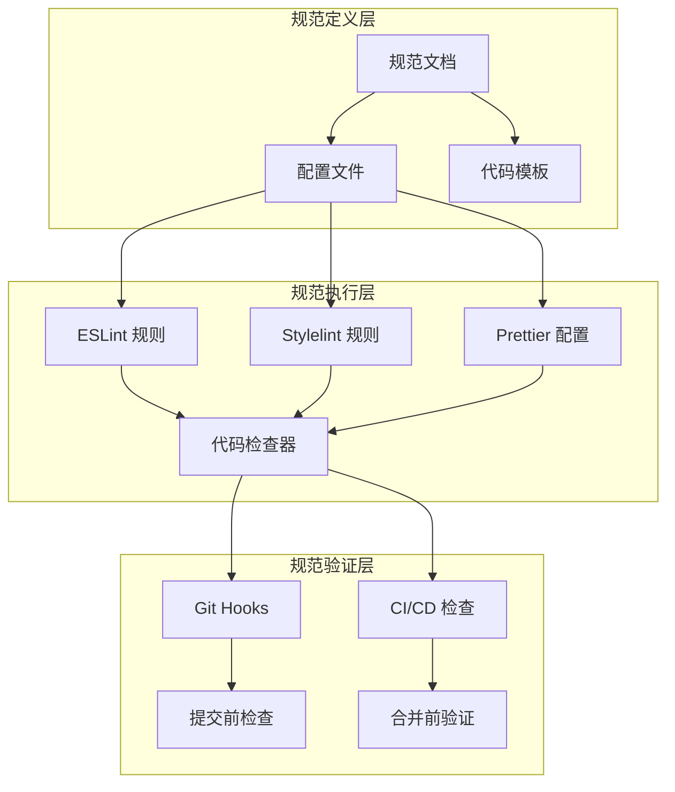

# 设计文档：网站开发规范（Vue 3 全家桶）

## 概述

本设计文档基于需求文档，详细定义了 Vue 3 全家桶（Vue 3 + Vue Router + Pinia + Vite）网站开发规范的技术实现方案。规范系统将通过配置文件、代码检查工具和文档模板的形式落地，确保团队开发的一致性和代码质量。

## 架构

### 整体架构

规范系统采用分层架构，包含以下核心层次：



### 项目目录结构

```
project-root/
├── src/
│   ├── assets/              # 静态资源
│   │   ├── images/
│   │   ├── fonts/
│   │   └── styles/
│   │       ├── variables.css    # CSS 变量
│   │       ├── reset.css        # 样式重置
│   │       └── global.css       # 全局样式
│   ├── components/          # 公共组件
│   │   ├── common/          # 通用基础组件
│   │   └── business/        # 业务组件
│   ├── composables/         # 组合式函数
│   ├── directives/          # 自定义指令
│   ├── layouts/             # 布局组件
│   ├── pages/               # 页面组件（或 views/）
│   ├── router/              # 路由配置
│   │   ├── index.ts
│   │   ├── routes.ts
│   │   └── guards.ts
│   ├── stores/              # Pinia 状态仓库
│   ├── services/            # API 服务层
│   ├── types/               # TypeScript 类型定义
│   ├── utils/               # 工具函数
│   ├── constants/           # 常量定义
│   ├── App.vue
│   └── main.ts
├── admin/                   # 后台管理系统（可选独立目录）
│   ├── src/
│   │   ├── components/
│   │   ├── pages/
│   │   ├── router/
│   │   ├── stores/
│   │   └── ...
│   └── ...
├── public/
├── .eslintrc.cjs
├── .prettierrc
├── .stylelintrc.cjs
├── vite.config.ts
├── tsconfig.json
└── package.json
```

## 组件与接口

### Vue 3 组件规范接口

#### 单文件组件结构

```vue
<script setup lang="ts">
// 1. 类型导入
import type { PropType } from 'vue'

// 2. 组件导入
import ChildComponent from './ChildComponent.vue'

// 3. 组合式函数导入
import { useCounter } from '@/composables/useCounter'

// 4. Props 定义
interface Props {
  title: string
  count?: number
  items: string[]
}

const props = withDefaults(defineProps<Props>(), {
  count: 0
})

// 5. Emits 定义
interface Emits {
  (e: 'update', value: number): void
  (e: 'submit'): void
}

const emit = defineEmits<Emits>()

// 6. 响应式状态
const localCount = ref(props.count)

// 7. 计算属性
const doubleCount = computed(() => localCount.value * 2)

// 8. 侦听器
watch(() => props.count, (newVal) => {
  localCount.value = newVal
})

// 9. 生命周期钩子
onMounted(() => {
  // 初始化逻辑
})

// 10. 方法
const handleClick = () => {
  emit('update', localCount.value)
}

// 11. 暴露给父组件的方法（可选）
defineExpose({
  reset: () => { localCount.value = 0 }
})
</script>

<template>
  <div class="component-name">
    <h1>{{ title }}</h1>
    <ChildComponent :count="doubleCount" />
    <button @click="handleClick">提交</button>
  </div>
</template>

<style scoped>
.component-name {
  /* 组件样式 */
}
</style>
```

### Pinia Store 规范接口

```typescript
// stores/useUserStore.ts
import { defineStore } from 'pinia'
import { ref, computed } from 'vue'
import type { User } from '@/types'

export const useUserStore = defineStore('user', () => {
  // State
  const user = ref<User | null>(null)
  const token = ref<string>('')
  const loading = ref(false)

  // Getters
  const isLoggedIn = computed(() => !!token.value)
  const userName = computed(() => user.value?.name ?? '游客')

  // Actions
  const login = async (credentials: { username: string; password: string }) => {
    loading.value = true
    try {
      // API 调用
      const response = await authService.login(credentials)
      user.value = response.user
      token.value = response.token
    } finally {
      loading.value = false
    }
  }

  const logout = () => {
    user.value = null
    token.value = ''
  }

  return {
    // State
    user,
    token,
    loading,
    // Getters
    isLoggedIn,
    userName,
    // Actions
    login,
    logout
  }
}, {
  persist: {
    key: 'user-store',
    paths: ['token']
  }
})
```

### Vue Router 路由规范接口

```typescript
// router/routes.ts
import type { RouteRecordRaw } from 'vue-router'

export const routes: RouteRecordRaw[] = [
  {
    path: '/',
    name: 'Home',
    component: () => import('@/pages/HomePage.vue'),
    meta: {
      title: '首页',
      requiresAuth: false
    }
  },
  {
    path: '/dashboard',
    name: 'Dashboard',
    component: () => import('@/layouts/DashboardLayout.vue'),
    meta: {
      title: '控制台',
      requiresAuth: true,
      permissions: ['dashboard:view']
    },
    children: [
      {
        path: '',
        name: 'DashboardHome',
        component: () => import('@/pages/dashboard/DashboardHome.vue')
      },
      {
        path: 'users',
        name: 'UserManagement',
        component: () => import('@/pages/dashboard/UserManagement.vue'),
        meta: {
          permissions: ['user:manage']
        }
      }
    ]
  }
]

// router/guards.ts
import type { NavigationGuardNext, RouteLocationNormalized } from 'vue-router'
import { useUserStore } from '@/stores/useUserStore'
import { usePermissionStore } from '@/stores/usePermissionStore'

export const authGuard = (
  to: RouteLocationNormalized,
  from: RouteLocationNormalized,
  next: NavigationGuardNext
) => {
  const userStore = useUserStore()
  
  if (to.meta.requiresAuth && !userStore.isLoggedIn) {
    next({ name: 'Login', query: { redirect: to.fullPath } })
    return
  }
  
  next()
}

export const permissionGuard = (
  to: RouteLocationNormalized,
  from: RouteLocationNormalized,
  next: NavigationGuardNext
) => {
  const permissionStore = usePermissionStore()
  const requiredPermissions = to.meta.permissions as string[] | undefined
  
  if (requiredPermissions && !permissionStore.hasPermissions(requiredPermissions)) {
    next({ name: 'Forbidden' })
    return
  }
  
  next()
}
```

### API 服务层规范接口

```typescript
// services/api.ts
import axios, { type AxiosInstance, type AxiosRequestConfig } from 'axios'
import { useUserStore } from '@/stores/useUserStore'

const createApiClient = (): AxiosInstance => {
  const client = axios.create({
    baseURL: import.meta.env.VITE_API_BASE_URL,
    timeout: 10000,
    headers: {
      'Content-Type': 'application/json'
    }
  })

  // 请求拦截器
  client.interceptors.request.use(
    (config) => {
      const userStore = useUserStore()
      if (userStore.token) {
        config.headers.Authorization = `Bearer ${userStore.token}`
      }
      return config
    },
    (error) => Promise.reject(error)
  )

  // 响应拦截器
  client.interceptors.response.use(
    (response) => response.data,
    async (error) => {
      if (error.response?.status === 401) {
        const userStore = useUserStore()
        userStore.logout()
        window.location.href = '/login'
      }
      return Promise.reject(error)
    }
  )

  return client
}

export const api = createApiClient()

// 统一响应格式
export interface ApiResponse<T> {
  code: number
  message: string
  data: T
}

// 分页响应格式
export interface PaginatedResponse<T> {
  list: T[]
  total: number
  page: number
  pageSize: number
}
```

### 权限系统规范接口

```typescript
// stores/usePermissionStore.ts
import { defineStore } from 'pinia'
import { ref, computed } from 'vue'

export interface Permission {
  id: string
  name: string
  code: string
}

export interface Role {
  id: string
  name: string
  permissions: Permission[]
}

export const usePermissionStore = defineStore('permission', () => {
  const roles = ref<Role[]>([])
  const permissions = ref<string[]>([])

  const hasPermission = computed(() => (code: string) => {
    return permissions.value.includes(code) || permissions.value.includes('*')
  })

  const hasPermissions = (codes: string[]) => {
    return codes.every(code => hasPermission.value(code))
  }

  const hasAnyPermission = (codes: string[]) => {
    return codes.some(code => hasPermission.value(code))
  }

  const setPermissions = (perms: string[]) => {
    permissions.value = perms
  }

  return {
    roles,
    permissions,
    hasPermission,
    hasPermissions,
    hasAnyPermission,
    setPermissions
  }
})

// directives/permission.ts
import type { Directive } from 'vue'
import { usePermissionStore } from '@/stores/usePermissionStore'

export const vPermission: Directive<HTMLElement, string | string[]> = {
  mounted(el, binding) {
    const permissionStore = usePermissionStore()
    const permissions = Array.isArray(binding.value) ? binding.value : [binding.value]
    
    if (!permissionStore.hasPermissions(permissions)) {
      el.parentNode?.removeChild(el)
    }
  }
}
```


## 数据模型

### 类型定义规范

```typescript
// types/u