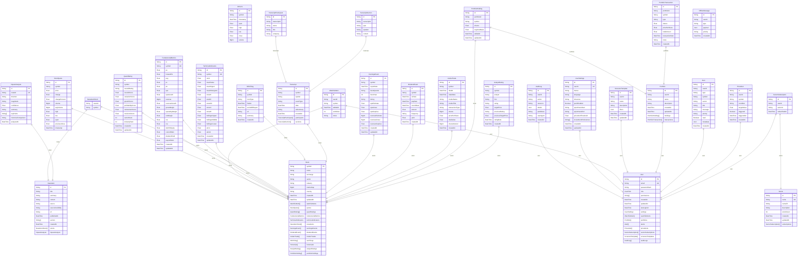

```mermaid
erDiagram
    User {
        String id PK
        String email UK
        String passwordHash
        UserRole role
        String[] permissions
        DateTime createdAt
        DateTime updatedAt
        DateTime lastLoginAt
        UserSettings settings
        WatchlistItem[] watchlistItems
        Portfolio[] portfolios
        Alert[] alerts
        PriceAlert[] priceAlerts
        SectorSubscription[] sectorSubscriptions
        ScreenerTemplate[] screenerTemplates
        AuditLog[] auditLogs
    }
    AuditLog {
        String id PK
        String userId
        String action
        String resource
        Json details
        String ipAddress
        String userAgent
        DateTime createdAt
    }
    UserSettings {
        String id PK
        String userId UK
        String theme
        String language
        String timezone
        Boolean pushEnabled
        String quietHoursStart
        String quietHoursEnd
        Float priceAlertThreshold
        String[] investmentPreferences
        DateTime createdAt
        DateTime updatedAt
    }
    WatchlistItem {
        String id PK
        String userId
        String symbol
        DateTime addedAt
        Int sortOrder
        String notes
    }
    Stock {
        String symbol PK
        String name
        String exchange
        String sector
        String industry
        BigInt marketCap
        String country
        DateTime createdAt
        DateTime updatedAt
        WatchlistItem[] watchlistItems
        StockQuote[] quotes
        QuantRating[] quantRatings
        FundamentalMetrics fundamentalMetrics
        TechnicalIndicators technicalIndicators
        NewsItemStock[] newsItems
        EarningsEvent[] earningsEvents
        DividendEvent[] dividendEvents
        InsiderTrade[] insiderTrades
        SECFiling[] secFilings
        Transcript[] transcripts
        AnalystRating[] analystRatings
        PortfolioHolding[] portfolioHoldings
    }
    StockQuote {
        String id PK
        String symbol
        Float price
        Float change
        Float changePercent
        BigInt volume
        BigInt avgVolume
        Float high
        Float low
        Float open
        Float previousClose
        DateTime timestamp
    }
    OHLCV {
        String id PK
        String symbol
        DateTime timestamp
        Float open
        Float high
        Float low
        Float close
        BigInt volume
    }
    QuantRating {
        String id PK
        String symbol
        String overallRating
        Float overallScore
        Float valuationScore
        Float growthScore
        Float profitabilityScore
        Float momentumScore
        Float revisionsScore
        Int sectorRank
        Int industryRank
        DateTime createdAt
        DateTime updatedAt
    }
    FundamentalMetrics {
        String id PK
        String symbol UK
        Float pe
        Float forwardPe
        Float peg
        Float ps
        Float pb
        Float eps
        Float epsGrowth
        BigInt revenue
        Float revenueGrowth
        Float grossMargin
        Float operatingMargin
        Float netMargin
        Float roe
        Float roa
        Float debtToEquity
        Float currentRatio
        Float dividendYield
        Float payoutRatio
        DateTime createdAt
        DateTime updatedAt
    }
    TechnicalIndicators {
        String id PK
        String symbol UK
        Float rsi14
        Float macdValue
        Float macdSignal
        Float macdHistogram
        Float sma20
        Float sma50
        Float sma200
        Float ema12
        Float ema26
        Float bollingerUpper
        Float bollingerMiddle
        Float bollingerLower
        Float atr14
        Float adx14
        DateTime createdAt
        DateTime updatedAt
    }
    NewsItem {
        String id PK
        String title
        String summary
        String content
        String source
        String sourceCredibility
        String url
        DateTime publishedAt
        String[] sectors
        DateTime createdAt
        NewsItemStock[] stocks
        ImpactAnalysis impactAnalysis
    }
    NewsItemStock {
        String newsId
        String symbol
    }
    ImpactAnalysis {
        String id PK
        String newsId UK
        String direction
        String magnitude
        Float confidence
        String summary
        String[] keyPoints
        String historicalComparison
        DateTime analyzedAt
    }
    SECFiling {
        String id PK
        String symbol
        String formType
        DateTime filedAt
        DateTime periodOfReport
        String url
        String summary
        DateTime createdAt
    }
    Transcript {
        String id PK
        String symbol
        String quarter
        String eventType
        DateTime date
        String aiSummary
        DateTime createdAt
        TranscriptParticipant[] participants
        TranscriptSection[] sections
    }
    TranscriptParticipant {
        String id PK
        String transcriptId
        String name
        String title
        String company
    }
    TranscriptSection {
        String id PK
        String transcriptId
        String type
        String speaker
        String content
    }
    EarningsEvent {
        String id PK
        String symbol
        DateTime reportDate
        String fiscalQuarter
        Int fiscalYear
        String timing
        Float epsEstimate
        Float epsActual
        Float epsSurprise
        BigInt revenueEstimate
        BigInt revenueActual
        Float revenueSurprise
        DateTime createdAt
        DateTime updatedAt
    }
    DividendEvent {
        String id PK
        String symbol
        DateTime exDate
        DateTime payDate
        DateTime recordDate
        Float amount
        String frequency
        Float yield
        DateTime createdAt
    }
    InsiderTrade {
        String id PK
        String symbol
        DateTime filedAt
        DateTime tradeDate
        String insiderName
        String insiderTitle
        String transactionType
        BigInt shares
        Float pricePerShare
        Float totalValue
        BigInt sharesOwned
        DateTime createdAt
    }
    ScreenerTemplate {
        String id PK
        String userId
        String name
        String description
        Json filters
        DateTime createdAt
        DateTime updatedAt
    }
    Portfolio {
        String id PK
        String userId
        String name
        String description
        DateTime createdAt
        DateTime updatedAt
        PortfolioHolding[] holdings
        PortfolioTransaction[] transactions
    }
    PortfolioHolding {
        String id PK
        String portfolioId
        String symbol
        Float shares
        Float avgCostBasis
        DateTime addedAt
        DateTime updatedAt
    }
    PortfolioTransaction {
        String id PK
        String portfolioId
        String symbol
        String type
        Float shares
        Float pricePerShare
        Float totalAmount
        DateTime transactionDate
        String notes
        DateTime createdAt
    }
    Alert {
        String id PK
        String userId
        String type
        String symbol
        String sector
        String title
        String message
        String priority
        Boolean read
        Json metadata
        DateTime createdAt
    }
    PriceAlert {
        String id PK
        String userId
        String symbol
        String condition
        Float targetValue
        Boolean triggered
        DateTime triggeredAt
        DateTime createdAt
    }
    Sector {
        String id PK
        String name UK
        String nameZh
        String description
        Int stockCount
        DateTime createdAt
        DateTime updatedAt
        SectorSubscription[] subscriptions
    }
    SectorSubscription {
        String id PK
        String userId
        String sectorId
        DateTime subscribedAt
    }
    AnalystRating {
        String id PK
        String symbol
        String analyst
        String firm
        String rating
        Float targetPrice
        String previousRating
        Float previousTargetPrice
        DateTime ratingDate
        DateTime createdAt
    }
    OfflineMessage {
        String id PK
        String userId
        String type
        Json payload
        String priority
        DateTime createdAt
    }

    AuditLog ||--|| User : "user"
    UserSettings ||--|| User : "user"
    WatchlistItem ||--|| User : "user"
    WatchlistItem ||--|| Stock : "stock"
    StockQuote ||--|| Stock : "stock"
    QuantRating ||--|| Stock : "stock"
    FundamentalMetrics ||--|| Stock : "stock"
    TechnicalIndicators ||--|| Stock : "stock"
    NewsItemStock ||--|| NewsItem : "news"
    NewsItemStock ||--|| Stock : "stock"
    ImpactAnalysis ||--|| NewsItem : "news"
    SECFiling ||--|| Stock : "stock"
    Transcript ||--|| Stock : "stock"
    TranscriptParticipant ||--|| Transcript : "transcript"
    TranscriptSection ||--|| Transcript : "transcript"
    EarningsEvent ||--|| Stock : "stock"
    DividendEvent ||--|| Stock : "stock"
    InsiderTrade ||--|| Stock : "stock"
    ScreenerTemplate ||--|| User : "user"
    Portfolio ||--|| User : "user"
    PortfolioHolding ||--|| Portfolio : "portfolio"
    PortfolioHolding ||--|| Stock : "stock"
    PortfolioTransaction ||--|| Portfolio : "portfolio"
    Alert ||--|| User : "user"
    PriceAlert ||--|| User : "user"
    SectorSubscription ||--|| User : "user"
    SectorSubscription ||--|| Sector : "sector"
    AnalystRating ||--|| Stock : "stock"
```
